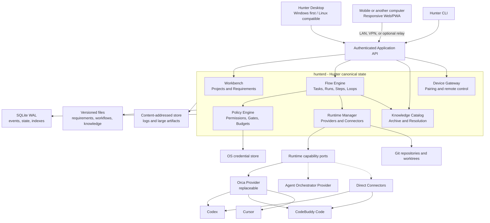

# Hunter Platform 系统架构

## 架构结论

Hunter Platform 首版采用**本地优先的模块化单体**：一个产品安装包、一个本地服务 `hunterd`、一个共享 Web UI。桌面端、移动 Web/PWA 和 CLI 只能通过应用模块接口访问业务能力，不能绕过模块直接修改数据库。

逻辑上分为 Workbench、Flow 和 Runtime 三层，物理上先在一个 Monorepo 和一个本地服务中演进。只有出现明确的独立伸缩、隔离或团队部署需求时才拆服务。

## 系统视图



## 模块边界

| Module | 稳定接口职责 | 隐藏的复杂性 |
|---|---|---|
| `ProjectCatalog` | 创建 Project、绑定 Repository/Device、查询项目投影 | 多仓库身份、设备路径映射 |
| `Requirements` | 起草、审核、批准、修订 Requirement 与 Change | 不可变 Revision、覆盖关系、状态转换 |
| `FlowEngine` | 发布 Workflow、规划 Task、启动/控制/查询 Run | DAG 调度、Loop、幂等、重试、恢复 |
| `RuntimeManager` | 选择能力、分配 Workspace/Session、发出控制命令 | Orca、PTY、原生进程、能力降级 |
| `ArtifactRepository` | 注册、寻址和读取 Artifact/Evidence | 文件哈希、去重、来源与生命周期 |
| `KnowledgeCatalog` | 归档入库、知识提升、冲突与上下文解析 | 等级、替代关系、范围、置信度 |
| `PolicyEngine` | 返回 allow、deny 或 require-approval | 项目规则、工具权限、风险、预算 |
| `DeviceGateway` | 配对、认证、授权、撤销和远程命令 | 密钥、令牌、连接与离线状态 |

模块之间使用命令、查询、稳定 ID 和领域事件。数据库事务可以在单体内部保证一致性，但调用方不能依赖另一个模块的表结构。

## Runtime 能力端口

`RuntimeProvider` 不是一个包办一切的万能对象，而是以下可组合端口：

- `AgentDiscovery`：发现安装、登录和版本状态。
- `WorkspaceProvider`：准备 Repository、branch、worktree 或只读快照。
- `ProcessHost`：管理进程、PTY、输出和生命周期。
- `AgentConnector`：launch、send、resume、interrupt、approve 等结构化动作。
- `SessionObserver`：接收协议或可证明的会话状态。
- `NativeSurfaceOpener`：打开终端、Cursor 或其他原生界面。
- `ArtifactCollector`：收集文件、Diff、测试报告和日志。
- `CompletionVerifier`：为 Flow 提供机器验证结果，但不直接推进状态机。

每个实现发布 Capability Manifest。Flow 根据步骤要求选择实现，不按产品名猜能力。

接入优先级为：

```text
正式结构化协议
  -> 官方 Headless JSON
    -> 受管 PTY
      -> 原生应用 Handoff
```

## Connector 能力等级

| Level | 可证明能力 | Hunter 行为 |
|---|---|---|
| L0 Manual/Launch | 打开正确应用或工作区，准备任务包 | 等待用户操作与人工完成确认 |
| L1 Observable | L0 + 进程、Git、文件、日志或 Artifact 观察 | 显示可观察状态，仍不声称完整控制 |
| L2 Controllable | 官方 CLI、ACP、app-server 或 RPC 的启动、发送、中断、结果 | 可自动执行并接收结构化返回 |
| L3 Governed | L2 + 权限事件、工具事件、可靠恢复、完成回执 | 可受 Policy/Gate 治理并高可信恢复 |

首批目标：Codex L2/L3，CodeBuddy Code L2/L3，Cursor L0/L1。任何能力缺失都必须显式降级；不得通过解析模糊终端文本伪造 L2/L3。

## Orca 集成策略

Orca 只作为 Phase 0 首个有时限、可逆的候选，用来验证终端、worktree、Git、Agent 进程与移动控制基础；Phase 0 通过前不把它视为已采用产品依赖：

1. 先通过公开 JSON CLI/API 实现独立 Provider，不修改 Orca。
2. 在 Windows 实测 ConPTY、会话、worktree、重启、权限和移动端边界。
3. 只有统一客户端体验确有必要时，才评估增加 Hunter 页面和启动逻辑的薄 Fork。
4. Hunter Core、数据库、Workflow 与知识规则永不存入 Orca 私有模型。
5. Orca 不满足契约时，可替换为 Agent Orchestrator、Direct Connector 或 Hunter 实现。

Orca 或任何 Agent 的跳过权限参数不得成为 Hunter 默认值。

## 数据架构

### SQLite WAL

保存：

- ID、关系和当前运行投影
- Append-only domain event
- 幂等键、Lease、重试与恢复元数据
- 可重建的查询索引

数据库不保存秘密，也不作为需求、工作流或知识正文的唯一载体。

### 版本化文件区

保存可读、可迁移正文：

- RequirementRevision 和 ChangeRevision
- WorkflowRevision 和项目覆盖
- ExecutionPlan、Archive manifest 与 KnowledgeEntry 正文

文件是内容事实源；SQLite 是关系、事件、索引和动态状态事实源。

### Content-addressed store

按内容哈希保存大日志、附件、截图、测试报告和构建产物。数据库只保存引用、媒体类型、大小、来源和保留策略。

### Git/worktree

源码的事实源仍是 Git Repository。Hunter 管理 WorkspaceLease 和 worktree，但不复制为私有代码网盘。

### 凭据

Token 和密钥存入 Windows Credential Manager 或 Linux Secret Service。数据库和版本化文件只保存 SecretRef。

## 执行和恢复

1. 状态变化先追加领域事件，再在同一事务中更新查询投影。
2. 所有外部启动和控制命令携带幂等键。
3. Runtime 为 Session、Process、Workspace 和 Controller 保存独立引用与 Lease。
4. `hunterd` 重启后向 Provider 和 Connector 重新对账。
5. 无法证明原会话仍存在时标记 `stale` 或 `needs_attention`，不猜测成功。
6. Verifier 必须可安全重跑；有副作用步骤必须声明恢复或人工处置策略。
7. 外部事件使用去重 ID，晚到和重复事件不能让状态机倒退。

## 并发与工作区

- 顺序写步骤默认沿用同一个 Workflow worktree。
- 只读 Task 可以共享固定 Commit 的快照。
- 并行写 Task 必须获得不同 WorkspaceLease，并使用独立 Git worktree。
- 汇合、冲突解决和集成测试是显式 Task/Step。
- 同一 NativeSession 必须绑定原 Workspace；切换 Workspace 时创建新 Session 或受支持的显式迁移。
- 非 Git 目录首版实行单写者，不自研文件合并系统。

## 本地与远程访问

- `hunterd` 默认只监听本机。
- Desktop 使用本地认证通道访问；CLI 使用同一应用 API。
- 移动设备通过一次性配对建立独立设备密钥。
- 局域网或 Tailscale/WireGuard 可直连；加密中继是后续可选组件。
- 远程设备按能力授权，可单独撤销。
- 主机离线时只展示已同步摘要，不伪装实时控制。
- 手机默认不能执行高危命令、修改安全策略或读取未授权源码。

## 平台策略

- Windows 是 Phase 0 和 Phase 1 的硬验收环境：路径、ConPTY、Job Object、凭据库、进程树和原生应用启动都需真实测试。
- Linux 的路径、process group、Secret Service 和包格式在接口层保持同构；Phase 2 完成正式安装包验收。
- 平台差异封装在 ProcessHost、WorkspaceProvider、SecretStore 和 NativeSurfaceOpener 内，不泄漏到 Flow 领域模型。

## 推荐 Monorepo 形态

```text
hunter-platform/
├─ apps/
│  ├─ desktop/
│  ├─ web/
│  └─ daemon/
├─ packages/
│  ├─ domain/
│  ├─ flow-engine/
│  ├─ knowledge/
│  ├─ storage/
│  ├─ runtime-contracts/
│  ├─ provider-orca/
│  ├─ connector-codex/
│  ├─ connector-codebuddy/
│  ├─ connector-cursor/
│  ├─ policy/
│  └─ testkit/
├─ workflow-packs/
│  └─ hunter-default/
└─ docs/
```

Hunter-Harness 继续作为 Workflow/Skill 内容包与可选分发仓库；旧 Registry 不定义 Hunter Platform 的 Project，也不是本地执行依赖。Goose 专用 Gate、版本 Pin 和 30 天 Pilot 不迁入主产品。
