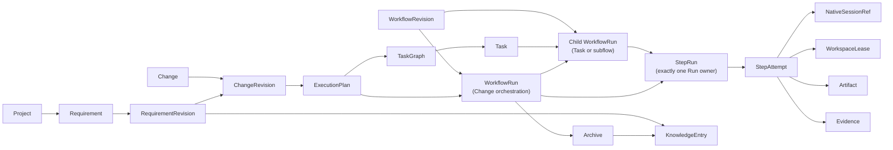
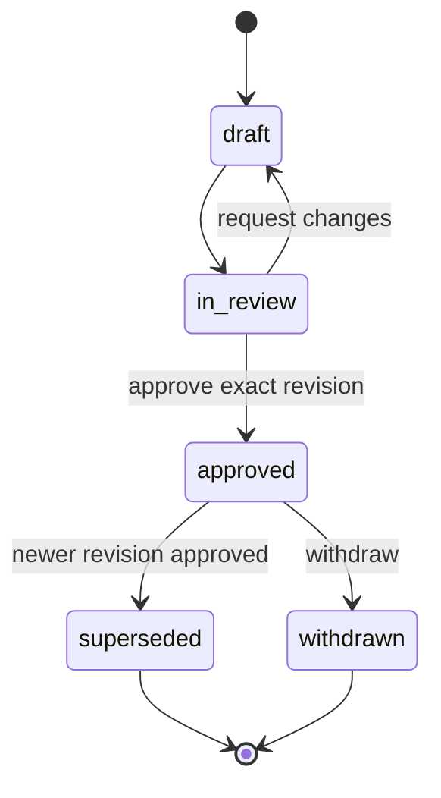
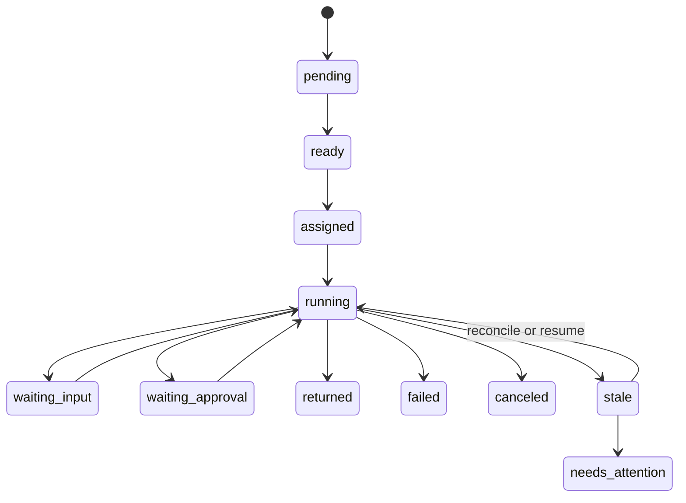
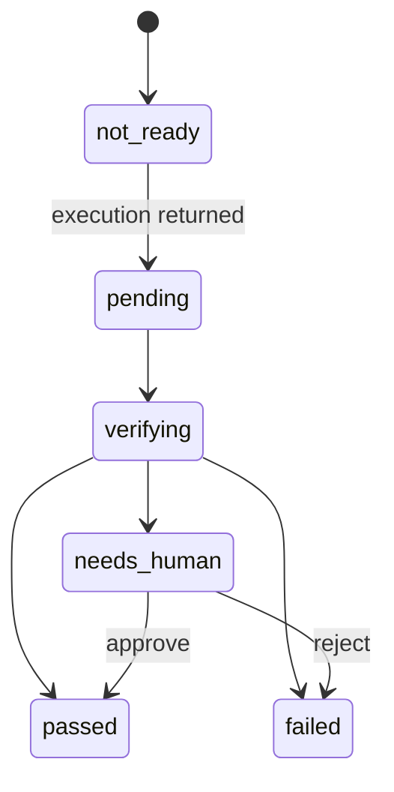
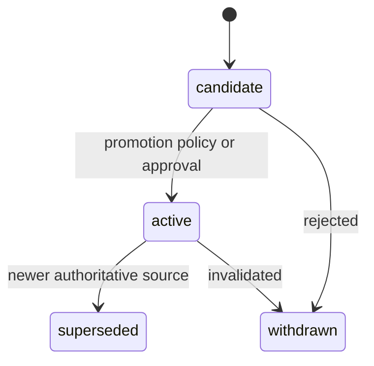

# Hunter Platform 领域模型与状态机

## 领域主链



实体、Revision 和运行实例必须分开：实体提供长期身份，Revision 提供不可变语义，Run/Attempt 记录实际发生的执行。

## Workbench

### Project

`Project` 表示一个完整产品或目标，而不是一个仓库。它拥有：

- 零到多个 Requirement
- 一个主 Repository 和零到多个附属 Repository
- 一个或多个 DeviceBinding
- 默认 Workflow、AgentProfile、Policy 和知识解析设置
- 多个同时存在的 Change 与 WorkflowRun

首版 UI 优先支持单仓库路径，但接口和存储必须允许多仓库。ProjectId 不由路径、Git remote 或目录名推导。

### Repository 与 DeviceBinding

`Repository` 记录规范化 VCS 身份与 Project 内角色。`DeviceBinding` 记录该 Repository 在特定 Device 的本地路径、可用性和最后验证时间。

同一个 Repository 在不同设备上可以有完全不同路径。移动端和远端 API 只能使用 RepositoryId/DeviceId，不传输可被误认为全局身份的绝对路径。

## Requirements

### Requirement 与 RequirementRevision

`Requirement` 是长期意图的身份容器。正文、约束、验收标准和批准状态属于 `RequirementRevision`。



规则：

- `approved` Revision 内容不可变。
- 修改通过 RequirementAmendment 产生新 Revision。
- 新 Revision 获批后，旧 Revision 标记 `superseded`，但不删除。
- WorkflowRun 永远引用启动时的 RevisionId；需求变化不会偷换运行依据。
- 执行中的变更可以选择继续、暂停、终止或基于新 Revision 创建新的 Change/Plan。

### Change 与 ChangeRevision

`Change` 表示一次可交付、可验证的实现切片。`ChangeRevision` 固定以下信息：

- 目标和非目标
- 所覆盖的一个或多个 RequirementRevision
- 目标 Project/Repository 范围
- 验收条件、约束和风险
- 与其他 Change 的依赖

一个 Requirement 可由多个 Change 分期实现；一个 Change 也可覆盖多个关联 Requirement。Draft ChangeRevision 可以编辑，已发布或已被 ExecutionPlan 固定的 Revision 不可覆盖修改。

`ChangeRevision` 的内容生命周期是 `draft -> published -> superseded|withdrawn`。
只有 `published` Revision 可进入 ExecutionPlan；发布后内容不可变，范围调整必须
创建新 Revision。下方的 `planned/ready/executing/...` 是 Change 实体基于计划与 Run
汇总出的交付状态，不是允许覆盖 Revision 正文的编辑状态。

建议状态：

```text
draft -> planned -> ready -> executing -> verifying -> completed
                    |             |            |
                    +-> blocked   +-> canceled +-> failed
```

状态是 Change 当前投影；每次实际执行的完整历史由 WorkflowRun 保存。

## Flow

### Workflow Template 与 Revision

`WorkflowTemplate` 提供稳定身份，`WorkflowRevision` 固定步骤图、输入输出契约、路由、LoopPolicy 和默认预算。ProjectWorkflowBinding 固定引用某个 Revision，并仅允许覆盖该 Revision 声明为可配置的参数。

模板升级不会改变正在运行或已配置的项目。用户必须预览差异并显式迁移到新 Revision。

### ExecutionPlan、TaskGraph 与 Task

ExecutionPlan 针对一个 ChangeRevision 生成，TaskGraph 是其可调度结构。

每个 Task 至少包含：

- `task_id` 和稳定标题
- 目标与验收条件
- 目标 Repository/模块
- `depends_on`
- 读写性质
- 建议 WorkflowRevision/子流程
- Agent/Session/Workspace 策略的默认选择

TaskGraph 是 DAG。Loop 属于 Workflow 内部的显式有界回边，不通过在 TaskGraph 中构造任意环实现。

Task 和 WorkflowStep 的区别：

- Task 是“实现认证 API”这样的工作单元。
- WorkflowStep 是“计划、实现、测试、评审、归档”这样的处理阶段。
- 一个 ChangeRevision 启动一个顶层 WorkflowRun，顶层 Run 持有
  ExecutionPlan/TaskGraph 的调度历史。
- 一个 Task 可启动一个 ChildRun；多个 Task 由顶层 Run 按依赖编排。
- SubflowStep 也可启动 ChildRun，但不改变 Requirement/Change 的冻结依据。

### WorkflowRun、StepRun 与 StepAttempt

`WorkflowRun` 固定绑定：

- ProjectId
- ChangeRevisionId
- RequirementRevisionId 集合
- ExecutionPlanId/TaskId（适用时）
- WorkflowRevisionId
- 初始 RunBudget 与 PolicySnapshot

同一实体表达两种明确 subject：

- 顶层 orchestration Run：`subject_kind=change`，有 ExecutionPlanId，
  `TaskId=null`、`parent_run_id=null`。
- 子 Run：`subject_kind=task|subflow`，必须有 `parent_run_id`；Task 子 Run
  还必须有 TaskId。

每个 StepRun 只属于一个 WorkflowRun。顶层 Run 可以拥有跨 Task 的 Gate、
fan-out/fan-in 与集成 Step；Task 内的实现/测试步骤属于对应 ChildRun。这样
既不增加含糊的 ChangeRun 对象，也不会把 TaskGraph 和 WorkflowGraph 合并。

`StepRun` 是一个逻辑步骤。`StepAttempt` 是一次实际尝试，记录：

- 输入快照与 HandoffPack hash
- AgentProduct、AgentProfile 和 Connector capability snapshot
- SessionPolicy、NativeSessionRef 和 DeviceId
- WorkspacePolicy、WorkspaceLease 和 Commit 基线
- 开始/结束时间、终止原因和预算消耗
- Artifact、Evidence、验证结果和输出

Loop 和 retry 永远创建新的 StepAttempt；旧 Attempt 不被覆盖或“清理为成功”。

## 双状态模型

执行状态和验证状态分开保存。

### ExecutionStatus



### VerificationStatus



StepRun 只有在所需 Attempt 的 `ExecutionStatus=returned` 且 `VerificationStatus=passed` 时才能成功。进程退出、终端空闲、Cursor 打开或 Agent 自报完成均不能单独满足这个条件。

### StepRun 结论状态

```text
pending -> active -> succeeded
                  -> failed
                  -> blocked
                  -> canceled
```

结论状态是双状态与路由规则计算出的投影，不应由 Connector 直接写入。

## Runtime

### 四种“同一个 Agent”

领域模型不使用单一 `agent_id` 混合以下概念：

- 同一个 `AgentProduct`：例如都使用 Codex。
- 同一个 `AgentProfile`：例如同一模型、角色、Skill 和权限配置。
- 同一个 `NativeSessionRef`：外部工具里的同一原生会话。
- 同一个执行实例/Device：同一台机器上的具体进程或窗口。

SessionPolicy 的含义：

- `reuse`：要求复用当前 NativeSession；不支持时停止并请求处理。
- `resume_if_supported`：优先恢复；不能恢复时创建新 Session 并注入 HandoffPack。
- `new`：创建独立会话。
- `manual`：打开原生界面并等待人工回执。

### Connector capability

能力按原子能力和 L0-L3 等级发布。等级是便于展示的摘要，调度仍应检查具体 capability。Connector 升级后不会追溯修改旧 Attempt 保存的能力快照。

### Lease

- WorkspaceLease 防止多个写入 Attempt 同时修改同一工作区。
- ControllerLease 防止 Hunter Desktop、手机和原生终端同时向一个会话输入。
- Lease 有 owner、scope、generation、expiry 和续租策略。
- 失去 Lease 时进入 `stale/needs_attention`，不能自动夺取仍可能活跃的控制权。

## Artifact、Evidence 与 Knowledge

### Artifact 与 Evidence

Artifact 是可寻址产物；Evidence 是支持结论的事实。一个测试报告可以同时是 Artifact，并由 Evidence 引用其哈希、执行命令、退出码和时间来证明一次验证。

每个对象至少保存：

- 来源 Project/Run/Step/Attempt
- 生成者与采集方式
- 内容引用或结构化值
- 哈希、媒体类型、大小与时间
- 目标 Repository/Commit/Workspace（适用时）

### Archive

成功、失败和取消的 WorkflowRun 都可以生成 Archive。Archive 固定清单和来源，不改变原始 Run。

### KnowledgeEntry

所有 Archive 自动索引为 HistoricalKnowledge。AuthoritativeKnowledge 和 ExperientialKnowledge 具有不同提升与注入规则：



知识正文不脱离 KnowledgeSource。RequirementRevision、ADR 和项目规则可按政策成为 AuthoritativeKnowledge；执行经验必须包含 Evidence、ApplicabilityScope、Confidence 和失效条件。

## 关键不变量

1. Project 可以多仓库，路径只存在于 DeviceBinding。
2. 已批准 RequirementRevision、已发布或已固定 ChangeRevision、已发布 WorkflowRevision 不可变。
3. WorkflowRun 不允许在执行中替换需求、Change 或 Workflow Revision。
4. Task 与 WorkflowStep 是不同对象。
5. Loop/retry 创建新 StepAttempt。
6. Agent 返回不等于验证通过。
7. Flow 是步骤结论的唯一权威；Runtime 只报告能力、执行和观察事实。
8. 并行写入必须使用隔离 WorkspaceLease。
9. NativeSessionRef 不等于 RunId，Provider 状态不等于 Hunter 状态。
10. 全部归档进入知识体系，但只有当前有效且策略允许的知识自动注入。
11. 所有跨域引用指向稳定 ID 或不可变 RevisionId。
12. 任何自动 Loop 必须能由轮数、时间、成本、重复失败或人工操作终止。

## 幂等与审计

- Command 使用 `command_id`/`idempotency_key`。
- 外部启动使用由 Run/Attempt/operation 派生的稳定 key。
- Domain event 追加后不可修改；纠正通过补偿事件表达。
- Approval 保存 Actor、设备、Revision hash、Policy 和时间。
- 查询状态是事件和当前对象计算出的投影，可以重建。
- Artifact、Requirement、Workflow、HandoffPack 和 Archive 都保存内容哈希。
