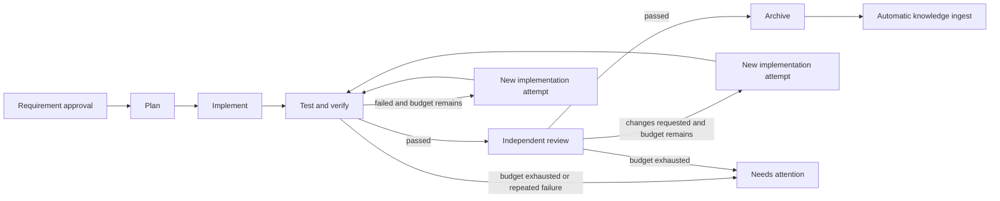

# Hunter Flow 工作流与 Loop 语义

## 目标

Hunter Flow 把“让 Agent 继续做，直到完成”转换为可检查的确定性过程。它允许自动推进、并行和失败回路，但每个动作都有固定输入、输出契约、能力要求、验证器、预算和停止条件。

Flow 不实现 Agent 自身的推理 Loop。它负责在 Agent Loop 之外编排 Task、会话、工作区和验证。

## 工作流步骤类型

首版支持六类步骤：

| Step type | 用途 | 成功依据 |
|---|---|---|
| `AgentStep` | 交给 Agent 计划、实现、分析或评审 | 结构化返回加 OutputContract 验证 |
| `CommandStep` | 执行测试、构建、Lint 或项目脚本 | 命令、退出码、结构化报告和策略 |
| `VerifyStep` | 检查 Diff、文件、测试、约束或产物 | Verifier 的可重复结论 |
| `HumanGateStep` | 需求确认、风险审批、人工验收 | 指定 Actor 对固定内容哈希的决定 |
| `ContextStep` | 选择、过滤、转换 Handoff/Knowledge 输入 | 生成符合 schema 的 Context/Handoff Pack |
| `SubflowStep` | 复用已发布的子流程 | 子 WorkflowRun 的最终验证结论 |

每个 StepDefinition 必须声明：

- InputContract 与 OutputContract
- Executor selector 或允许的 Step 实现
- AgentProfile selector（AgentStep）
- SessionPolicy 与 WorkspacePolicy
- 所需 ConnectorCapability
- Permission/Policy 要求
- Verifier
- timeout、retry 和 backoff
- LoopPolicy 与 RunBudget 消耗
- 成功、失败、取消、超时和人工拒绝后的确定性路由

没有 OutputContract 的自由聊天不能成为自动成功的工作流步骤。

## Requirement、Change、Task 与 Step

```text
RequirementRevision(s)
  -> ChangeRevision
    -> ExecutionPlan
      -> TaskGraph
      -> WorkflowRun (Change orchestration, parent)
        -> Task
          -> Child WorkflowRun (Task workflow)
            -> WorkflowStep / StepRun
```

顶层 WorkflowRun 固定 ChangeRevision、ExecutionPlan 和 TaskGraph，并记录 Task
调度、跨 Task Gate、fan-out/fan-in 与集成结论。每个 Task 在 ready 后启动带
`parent_run_id` 的 Child WorkflowRun；SubflowStep 也使用相同父子机制。TaskGraph
决定不同工作单元何时可以调度；Task 绑定的 Workflow 决定该工作单元如何完成。
两层分离使同一个开发流程可以复用于不同 Task，也使一个 Change 能并行处理
多个互不依赖的 Task，而不把 Task DAG 与 Workflow 图重复建模。

### Task 调度

Task 在以下条件全部满足时变为 ready：

- 所有 `depends_on` Task 已达到声明的可接受结论。
- ChangeRevision 与 ExecutionPlan 仍是当前 Run 的固定输入。
- 目标 Device、Repository 和所需 Connector capability 可用。
- WorkspacePolicy 可以获得安全 Lease。
- 全局与 Project 并发、时间和成本预算允许。

任务失败后的行为由 ExecutionPlan 声明：阻塞依赖、走补偿 Task、允许人工豁免或终止 Change。Flow 不自行猜测。

## 默认开发工作流



Review 默认使用新的 NativeSession，避免实现会话自我确认。项目可以显式覆盖为同一 AgentProfile，但不能跳过独立 Verifier。

## Attempt 生命周期

一次 AgentStep 的基本序列：

1. Flow 固定输入、PolicySnapshot、预算和能力要求。
2. KnowledgeResolution 选择适用知识；ContextStep 生成 HandoffPack。
3. Runtime 根据 Profile、SessionPolicy、Device 和 WorkspacePolicy 分配资源。
4. 获得 WorkspaceLease 和 ControllerLease。
5. Connector 启动、恢复或打开原生 Agent。
6. Runtime 记录结构化事件、输出和可观察 Evidence。
7. Agent 返回，或 GUI 用户提交 Step Receipt。
8. Flow 将执行状态置为 `returned`，验证状态置为 `pending`。
9. Verifier 检查 OutputContract；需要时进入 Human Gate。
10. 通过后 StepRun 成功并沿路由推进；失败则根据 retry/LoopPolicy 创建新 Attempt 或暂停。

`Agent returned`、`process exited`、`terminal idle`、`window opened` 只能完成第 7 步附近的执行判断，不能越过验证。

## 完成证据优先级

当不同 Connector 控制深度不同，Hunter 使用以下由强到弱的完成来源：

1. 正式协议的结构化 completion/error/permission 事件。
2. Hunter Step Receipt，包含固定输入/输出 hash 和执行者确认。
3. 可重复 Verifier，例如测试、Git Diff、文件 schema 或 Artifact 检查。
4. 用户人工确认。

弱来源不能伪装成强来源。UI 应显示“执行已返回、验证失败”或“窗口已打开、等待人工确认”，而不是统一显示“完成”。

## 分级 Connector 行为

### L2/L3：Codex 与 CodeBuddy Code 目标路径

- 通过官方结构化接口启动或恢复会话。
- 发送 HandoffPack 引用和 Step 指令。
- 接收输出、工具/权限事件、中断与 completion。
- 能力存在时由 PolicyEngine 处理审批。
- 会话恢复失败时按 SessionPolicy 选择暂停或新会话降级。

### L0/L1：Cursor 首版路径

- 打开正确 Repository/worktree 和任务摘要。
- 将 HandoffPack 放入可复制或可导入位置。
- 观察进程、Git Diff、指定 Artifact 和测试结果。
- 用户在 Cursor 内工作，完成后提交 Step Receipt 或在 Hunter 中确认。
- Hunter 绝不声称能可靠发送消息、恢复聊天或知道 Cursor 是否“思考完成”，除非未来出现并验证正式接口。

## SessionPolicy

| Policy | 语义 | 失败处理 |
|---|---|---|
| `reuse` | 必须继续当前 NativeSession | 无法复用时停止并请求用户处理 |
| `resume_if_supported` | 优先恢复原会话 | 不支持/失败时创建新会话，注入完整 HandoffPack 并标记降级 |
| `new` | 明确创建独立会话 | 启动失败按 retry/替代 Connector 策略处理 |
| `manual` | 打开原生界面并由用户接管 | 等待 Step Receipt/人工确认 |

“交给同一个 Agent”默认表示同一个 AgentProfile，并尽量恢复同一 NativeSession；UI 必须分别展示产品、Profile、Session 和 Device，不能用一个开关隐藏差异。

## Handoff Pack

HandoffPack 是不可变、可哈希的上下文清单，至少包含：

- 固定 RequirementRevision 与 ChangeRevision
- 当前 Task 和 Step 目标、Input/OutputContract
- 允许使用的 AuthoritativeKnowledge 与已验证 ExperientialKnowledge
- 上一步 Artifact/Evidence 与关键决策
- 当前 Repository、基线 Commit、Workspace 与 Diff 摘要
- 已发生 Attempt、失败原因和不得重复的无效路径
- 权限范围、停止条件和剩余预算

历史知识可以被检索，但不会无条件塞入 HandoffPack。KnowledgeResolution 必须处理 `superseded`、范围不匹配和权威冲突。

## Loop 语义

Loop 是显式回边，不是无限 `while true`。LoopPolicy 至少包含：

- 允许从哪个 Step 回到哪个 Step
- `max_iterations`
- `max_elapsed_time`
- 可选 `max_cost`/token budget
- 每轮必须产生的有效进展条件
- 重复错误、无 Diff、Verifier 异常或需求变化的停止条件
- 是否复用 Profile、Session 和 Workspace
- 预算耗尽后的目标状态与通知策略

### 新 Attempt 规则

- 每轮实现、测试或评审都创建新的 StepAttempt。
- Attempt 保留原 Prompt/Handoff hash、Session、Diff、Evidence 和失败原因。
- 无有效 Diff、相同验证指纹连续出现或同一错误超过阈值时自动暂停。
- 新 RequirementRevision 出现时，当前 Run 不切换依据；根据 Policy 提醒用户继续、终止或重新规划。
- Verifier 自身失败与产品验证失败是不同错误类型，不能被同一个重试计数掩盖。

## 并行、隔离与汇合

### 只读并行

固定在同一 Commit 的分析/搜索 Task 可以共享只读快照；每个 Attempt 仍保存独立输入和输出。

### 写入并行

- 每个并行写 Task 创建独立 branch/worktree 和 WorkspaceLease。
- 同一 worktree 不允许两个写 Controller。
- 每个工作区保存基线 Commit、当前 HEAD 和外部修改检测。
- Agent Session 绑定创建它的 Workspace；不能静默换目录继续。

### 汇合

合并不是调度器的隐式副作用。ExecutionPlan 创建显式集成 Task，负责：

- 选择合并顺序
- 检测/解决冲突
- 运行集成测试与 Review
- 产生可验证的合并 Artifact/Evidence

Hunter 首版不默认自动 push、merge 到主分支或部署。这些动作需要项目策略和 Human Gate。

## 审批与远程控制

HumanGateStep 绑定固定 Revision/Artifact/Action hash。审批命令必须包含幂等键、Actor、Device 和期望状态版本。

- 手机重复提交同一审批只生效一次。
- 已过期或状态已经变化的审批返回冲突，不重新执行动作。
- 高危文件操作、凭据访问、发布、合并和部署可被 Policy 强制 Gate。
- 同一 Session 同时只有一个 ControllerLease；移动端 Steer 前必须取得或转移控制权。

## 重启与对账

`hunterd` 启动后的恢复流程：

1. 读取未终结 Run、StepAttempt、Lease 和待发送命令。
2. 查询 RuntimeProvider/Connector 的 Session、Process、Workspace 状态。
3. 根据稳定外部引用和幂等键匹配，而不是解析窗口标题。
4. 对重复或晚到事件去重。
5. 可证明仍运行的 Attempt 恢复观察；无法证明的标记 `stale`。
6. 可恢复会话按 Policy 续接；否则进入 `needs_attention` 或新会话 Handoff。
7. 重跑安全 Verifier；不自动重放有副作用命令。

状态未知是正常且必须可见的状态，不得为了线路“亮绿灯”而猜测。

## 示例：移动端需求的并行 Change

```text
Requirement: 支持手机远程操作
├─ Change A: 远程认证与控制 API
│  ├─ Task A1: 设备配对
│  └─ Task A2: Run 控制接口 (depends on A1)
├─ Change B: 移动 PWA
│  ├─ Task B1: Run 线路页
│  └─ Task B2: 审批页
└─ Change C: 端到端集成 (depends on Change A + Change B)
```

Change A 与 B 可以并行；其中写入任务使用独立 worktree。Change C 显式汇合分支并执行集成测试。每个 Task 可以使用相同默认 Workflow，也可绑定专用子流程。Codex 可规划、CodeBuddy 可实现、Cursor 可供人工接管，但完成结论始终由 Hunter Flow 和 Verifier 持有。

## 不支持的语义

- 运行时由 Agent 任意添加不可审计流程结构
- 无限循环或仅凭“继续努力”触发的 Loop
- 没有输入/输出契约的自动成功 AgentStep
- 解析普通终端文本来声称完整 Session 控制
- 并发 Agent 写同一 worktree
- 执行中替换 RequirementRevision、ChangeRevision 或 WorkflowRevision
- 自动将所有历史知识注入上下文
- 无 Policy/Human Gate 的默认 merge、push、发布或部署
