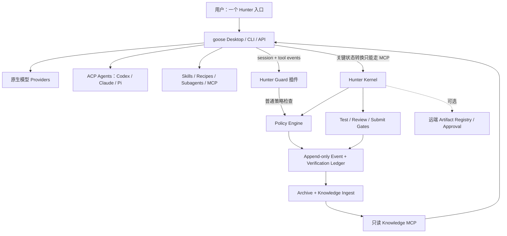

# 2026 Coding Agent Harness 深度调研与 Hunter Harness 战略建议

> **历史快照（已被取代）**：本文记录了 2026-07-20 的 Goose + 薄 Kernel
> 方案，不能作为 Hunter Platform 的现行设计或实施前置条件。当前结论见
> [`2026-07-21-hunter-platform-landscape-and-reuse.md`](2026-07-21-hunter-platform-landscape-and-reuse.md)。

> 调研日期：2026-07-20
> 结论性质：外部产品事实来自官方仓库、官方文档和官方公告；候选排序、适配判断与迁移建议属于基于这些事实和 Hunter 当前代码的分析判断。
> 目标：不是寻找“最像 Hunter”的项目，而是寻找最适合个人长期使用、功能足够且维护负担可控的最终形态。

## 0. 先给结论

**建议停止把 Hunter Harness 继续建设成独立的全栈 Agent Harness。**

更适合你的目标形态是：

> **用 AAIF goose 承担 Agent runtime、模型与 Agent 接入、Desktop/CLI/API、会话、工具、Skills、Plugins、Recipes 和 Subagents；把 Hunter 缩成一个很薄但强约束的治理内核，专注风险策略、阶段门禁、验证证据、归档知识和制品可信度。**

从用户视角，它仍然应当是“一套东西”：一个固定版本的发行配置、一个启动入口、一套 Hunter 插件/MCP/Skills，而不是两个需要分别理解的产品。

这不是立即删除现有仓库，而是：

1. **立即冻结**独立 Agent loop、模型 Provider、会话 UI、通用插件市场、调度器等扩张方向。
2. 用 30 天做一个 **goose + Hunter Guard** 可逆试点。
3. 试点通过后，退役当前 Server/Web/Provider/Skill CRUD 中与上游重复的部分。
4. 保留并抽取 Hunter 已经证明有价值的治理资产。
5. 如果 goose 无法满足强门禁，第二选择是 **OpenCode + Hunter 插件/sidecar**；如果需要完全掌控 Agent loop，再退回 **Pi AgentSession**，而不是继续自研全部基础设施。

### 为什么首选是 goose，而不是最初举例的三个项目

- **goose** 是本次扩展调研里最接近“可直接接管 Hunter 大部分平台职责”的候选：Apache-2.0、本地优先、Rust、原生 Windows Desktop/CLI、API、15+ 模型 Provider、MCP 扩展、Skills、Plugins、Hooks、Recipes、Subagents，并且能通过 ACP 把 Codex、Claude Code、Pi 等现有 Agent/订阅作为 Provider。它还明确支持 Custom Distribution。[官方仓库](https://github.com/aaif-goose/goose) · [Custom Distributions](https://goose-docs.ai/docs/guides/custom-distributions/) · [ACP Providers](https://goose-docs.ai/docs/guides/acp-providers/)
- **OpenCode** 是更成熟、完成度更高的 coding-first 产品和插件宿主，权限和 `tool.execute.before` 很适合嵌入 Hunter；但它更像“优秀的多模型 coding agent”，不是跨 Codex/Claude/Pi 的个人 Agent 汇聚层，而且官方在 Windows 上仍推荐 WSL。[插件](https://opencode.ai/docs/plugins/) · [Agents/Permissions](https://opencode.ai/docs/agents) · [Windows](https://opencode.ai/docs/windows-wsl)
- **Pi** 是最好的“自己组装 Agent Harness”工具箱：统一 LLM API、Agent runtime、coding CLI、TUI、RPC/SDK 和极强扩展性；但它明确没有内建权限系统，采用它意味着你仍需亲自承担安全、产品和治理集成。[官方仓库](https://github.com/earendil-works/pi)
- **Grok Build** 的产品能力很强，但公开仓库只是从 SpaceXAI monorepo 周期同步的源码快照，外部贡献不被接受，调研时只有 5 个公开 commit、无 GitHub release；它目前是优秀参考实现，不是稳健的社区底座。[官方仓库](https://github.com/xai-org/grok-build)

## 1. 先澄清：市场里的 “Harness” 不是同一种东西

把所有项目放在一个功能表里会得出错误结论。当前至少有五类产品：

| 类型 | 代表 | 真正负责什么 |
|---|---|---|
| 完整交互式 Coding Agent | OpenCode、Codex CLI、Claude Code、Cline、Grok Build、Crush | 模型循环、工具、权限、会话、TUI/IDE、日常编码体验 |
| 通用本地 Agent 平台 | goose | Desktop/CLI/API、Provider、MCP、工作流、跨 Agent 接入 |
| 可嵌入 Agent Toolkit/SDK | Pi、OpenHands SDK、Cline SDK | Agent loop、事件、工具、状态和宿主集成 |
| 自主任务/远程执行平台 | OpenHands、SWE-agent/mini-swe-agent | 容器 Runtime、issue-to-patch、批量任务、评测 |
| 流程治理与知识控制层 | Hunter Harness | 风险分级、Plan/Run/Test/Review/Submit/Archive、证据账本、知识归档、受管制品 |

Hunter 当前并没有自己的通用 coding Agent loop。它运行在 Claude Code、Codex、Cursor、CodeBuddy 等宿主之上，更准确的定位是：

> **Agent Workflow Governance / Evidence / Knowledge Control Plane**

这其实是优势。问题在于当前实现同时承担了本地 CLI、Server、Web Console、Skill/Artifact 管理、AI Provider 配置等越来越多的平台职责，开始与成熟上游重复。

## 2. 调研方法与候选范围

### 2.1 深挖候选

- AAIF goose
- OpenCode（当前活跃仓库为 `anomalyco/opencode`，不是已迁移/归档的旧仓库）
- Pi Agent Harness（当前仓库为 `earendil-works/pi`）
- xAI/SpaceXAI Grok Build
- Codex CLI / App Server
- OpenHands / OpenHands SDK
- Cline Runtime / SDK

### 2.2 横向扫描

- Claude Code
- Aider
- Charmbracelet Crush
- Gemini CLI / Antigravity CLI
- Roo Code
- SWE-agent / mini-swe-agent

### 2.3 评价标准

按你的使用情境，而不是按 GitHub star 排名：

1. 本地优先和 Windows 可用性。
2. 模型自由，以及复用现有 Codex/Claude/Pi Agent 或订阅的能力。
3. 日常编码功能是否足够，能否成为唯一入口。
4. Skills、Plugins、Hooks、MCP、ACP、SDK/API 等扩展面。
5. 是否能承载 Hunter 的强门禁、证据和知识闭环。
6. 会话、压缩、恢复、子代理、Worktree、Headless 能力。
7. Sandbox、权限、秘密和供应链边界。
8. 许可证、治理、活跃度和升级稳定性。
9. 个人长期维护成本。

## 3. 第一梯队正面对比

下表中的“优/中/弱”是适配 Hunter 目标的分析判断，不是项目官方评级。

| 维度 | goose | OpenCode | Pi | Grok Build |
|---|---|---|---|---|
| 最适合的角色 | 个人 Agent 平台/发行底座 | coding-first 主界面/插件宿主 | 自建 Harness SDK | xAI 产品与源码参考 |
| 开源/治理 | Apache-2.0；AAIF/Linux Foundation | MIT；活跃社区项目 | MIT；活跃项目 | Apache-2.0；单向源码同步 |
| Windows | 原生 Desktop/CLI | 可原生，官方推荐 WSL | Node/TS，可用 | 有官方 Windows 二进制；源码构建未持续测试 |
| 模型自由 | 15+ 原生 Provider + ACP Agent Provider | 多 Provider | 统一多 Provider API | 主要围绕 Grok/xAI |
| 复用 Codex/Claude/Pi | **优：ACP Provider** | 弱：主要是模型而非外部 Agent | 不适用，自身就是 runtime | 弱 |
| UI/入口 | Desktop + CLI + API | TUI + Desktop/Web/IDE + Server/SDK | TUI/CLI + RPC/SDK | TUI + Headless + ACP |
| Skills/Plugins/Hooks | 有，兼容 Open Plugins；MCP 为核心 | 很强；TS/JS plugin 和细粒度事件 | Extension 极灵活 | 有 Plugins/Hooks/Skills/MCP |
| 子代理/工作流 | Recipes、Subagents、Scheduler | Primary/Subagents、Task permission | Extension 可实现 | 并行 Subagents、Worktree |
| 强门禁承载 | **中**：PreToolUse 可阻断，但 hook 失败默认放行 | **优**：权限 + before hook 可抛错阻断 | **弱**：需自行建设 | 中上，但耦合与治理风险大 |
| OS Sandbox | 当前官方完整 Sandbox 主要是 macOS Desktop；可借 ACP 后端能力 | 主要是应用权限；不是统一 OS Sandbox | 明确无内建权限，需容器/沙箱 | 有 Sandbox profiles，但默认关闭 |
| Session/Resume | 本地会话完善；ACP Provider 尚不支持 fork/resume | 会话、compact、server event 完整 | Session tree/RPC/compaction 强 | resume/fork/export/import 完整 |
| 嵌入与定制 | API、ACP、MCP、Custom Distro | Server、OpenAPI/SDK、Plugins | **最强**：AgentSession/RPC/包级复用 | Headless/ACP，但上游不可协作 |
| 个人维护成本 | **低到中**，前提是不 fork core | **低到中** | 高 | 高风险 |
| Hunter 适配结论 | **首选试点** | 第二选择 | 高控制回退 | 不作为底座 |

## 4. 深挖一：goose

### 4.1 已确认能力

goose 官方将其定位为本地运行、可扩展的通用 Agent，而不只是 coding assistant。它提供原生 Desktop、CLI 和 API，支持 Windows，并通过 MCP 接入扩展。[仓库](https://github.com/aaif-goose/goose) · [Windows Quickstart](https://goose-docs.ai/docs/quickstart/)

它对 Hunter 最关键的能力有：

- 原生多 Provider，以及通过 ACP 使用 Codex、Claude、Amp、Pi 等 Agent；ACP 扩展还可以把 goose 的 MCP tools 透传给下游 Agent。[ACP Providers](https://goose-docs.ai/docs/guides/acp-providers/)
- 支持 Skills、Custom Agents、Subagents、Recipes、Prompt Templates、Plugins、Hooks、MCP、Headless、Remote Server 和 API。
- 官方明确支持自定义发行版，可预配 Provider、扩展、品牌、Prompt、Recipes 和子代理；也明确建议把差异留在配置、扩展和 Recipe 中以减少 fork 成本。[Custom Distributions](https://goose-docs.ai/docs/guides/custom-distributions/)
- 工具权限支持 Always Allow、Ask Before、Never Allow；同时有 Manual、Smart、Autonomous、Chat Only 等模式。[Tool Permissions](https://goose-docs.ai/docs/guides/managing-tools/tool-permissions/) · [Permission Modes](https://goose-docs.ai/docs/guides/goose-permissions/)
- 本地 SQLite 会话记录包含消息、tool call、参数、结果和 session metadata；CLI/Desktop 共用会话数据。[Logging](https://goose-docs.ai/docs/guides/logs/)
- 项目已进入 Linux Foundation 下的 Agentic AI Foundation，和 MCP、AGENTS.md 一起成为创始项目，治理与协议方向比单一厂商仓库更适合长期底座。[Linux Foundation 公告](https://www.linuxfoundation.org/press/linux-foundation-announces-the-formation-of-the-agentic-ai-foundation)

### 4.2 不能忽略的缺口

- `PreToolUse` hook 可以通过结构化输出或退出码阻断工具，但官方明确说明：hook 启动失败、超时或没有产生有效阻断信号时会 **fail-open**。[Hooks](https://goose-docs.ai/docs/guides/context-engineering/hooks/)
- 当前 hook 不发出 `SubagentStart`/`SubagentStop`，不能仅靠 hook 完整观测多 Agent 生命周期。
- ACP Provider 当前不能 `session resume/fork`，且 ACP session ID 与 goose session ID 不同，跨层证据关联需要桥接。
- 官方 OS Sandbox 目前完整实现主要面向 macOS Desktop；Windows 原生虽然可运行，但不能把应用级工具审批误认为 OS 隔离。[Sandbox](https://goose-docs.ai/docs/guides/sandbox/)
- Autonomous 是默认 permission mode。Hunter 发行配置必须显式改成 Smart/Manual，并锁定关键工具权限。

### 4.3 为什么这些缺口仍然可接受

因为 Hunter 不应把所有写文件和 shell 都重新实现一遍。应采用分层控制：

1. 普通工具调用由 goose 的权限系统和 `PreToolUse` 做第一道保护。
2. Hunter hook 记录前后事件并拦截明显越界路径、秘密和危险命令，但不把它宣传成唯一安全边界。
3. `submit`、merge、push、artifact publish、archive close 等关键状态转换只能通过 Hunter MCP/CLI，内部继续 fail-closed。
4. 高风险执行优先交给带 Sandbox 的 Codex ACP，或在容器/隔离 Worktree 中运行。
5. Hunter ledger 对外部会话 ID 建立映射，并从最终 Git diff、测试结果和制品 hash 重建可验证证据。

## 5. 深挖二：OpenCode

### 5.1 已确认能力

OpenCode 当前是最完整的开源 coding-first 候选之一：

- Client/Server 架构，Server 提供 OpenAPI/SDK；TUI、Web、Desktop/IDE 可共享后端。
- 多 Provider；Build/Plan 主 Agent，以及 General/Explore/Scout 等子代理。
- 工具、bash、路径、external directory、task、skill 等细粒度 `allow/ask/deny` 权限，支持全局与 Agent 覆盖。[Agents](https://opencode.ai/docs/agents)
- Skills 可从 `.opencode`、`.claude`、`.agents` 目录按需发现，对 Hunter 现有 Skill 资产迁移友好。[Skills](https://opencode.ai/docs/skills/)
- Plugin 可订阅 session、message、permission、file、tool before/after 等事件；`tool.execute.before` 可修改参数或通过异常阻断，例如保护 `.env`。[Plugins](https://opencode.ai/docs/plugins/)
- 支持自定义工具、MCP、ACP、Headless/Server 等现代扩展面。

### 5.2 相对 goose 的取舍

OpenCode 在编码 UX、权限粒度和 TypeScript 插件接入上更直接；如果目标只是“找一个最好的多模型 coding agent，然后嵌入 Hunter 门禁”，它可能比 goose 更省事。

但对你而言有三个劣势：

1. 它主要统一模型，不是统一已有 Codex/Claude/Pi Agent runtime；Hunter 的跨 Agent 目标会再次退化成多个 adapter。
2. Windows 官方仍推荐 WSL，这与你当前原生 Windows/PowerShell 工作区有摩擦。
3. 它不是专门为自定义发行版和通用个人工作流设计，Hunter 更像外接插件，而不是平台中自然的一层。

因此建议把 OpenCode 设为 **goose 试点失败后的第一回退**，而不是同时维护两个正式集成。

## 6. 深挖三：Pi

Pi 的包边界非常适合学习和二次开发：

- `pi-ai`：统一多 Provider LLM API。
- `pi-agent-core`：tool calling、状态和 Agent runtime。
- `pi-coding-agent`：交互式 coding CLI。
- `pi-tui`：终端 UI。
- AgentSession 和 JSONL RPC 适合 Node/TypeScript 直接嵌入；事件覆盖 turn、message、tool、compaction、retry、settled 等阶段。
- Extension 可以实现自定义工具、权限门、受保护路径、Sandbox、Subagents、Plan mode、Git checkpoints 和 compaction。

但官方明确说 Pi 没有内建权限系统，默认拥有启动它的用户/进程权限，并建议使用 Gondolin、Docker 或 OpenShell。[官方仓库](https://github.com/earendil-works/pi)

这意味着：

- 若最优先级是“我必须掌控每个 runtime 事件和数据结构”，Pi 是最佳底座。
- 若最优先级是“功能足够、少维护、马上成为日常唯一入口”，Pi 不是首选，因为你会重新建设权限、Sandbox、分发、Desktop/Server、会话运营和多 Agent 产品体验。

## 7. 深挖四：Grok Build

Grok Build 已具备完整 TUI、文件/终端/搜索工具、长任务、Headless、ACP、MCP、Skills、Plugins、Hooks、Subagents、Worktree、Sandbox profile 和 session import/export。[官方仓库](https://github.com/xai-org/grok-build)

但公开形态决定了它现在不适合作为 Hunter 的长期底座：

- 仓库是从 SpaceXAI monorepo 周期同步的源码快照，不是主开发仓。
- 官方不接受外部贡献。
- 调研时 GitHub 页面显示 5 个公开 commit、无 GitHub release。
- Windows 有官方二进制，但从公开源码构建在 Windows 上属于 best-effort，未持续测试。
- Third-party notices 表明部分工具实现移植自 Codex 和 OpenCode；它是强产品整合，并非所有底层设计都独立原创。

建议借鉴它的 Plan review、Headless/ACP、并行 Subagent/Worktree 和产品化 TUI，不要 fork。

## 8. 其他值得关注但不作为主底座的项目

| 项目 | 值得吸收 | 不作为主底座的原因 |
|---|---|---|
| Codex CLI/App Server | Thread→Turn→Item 事件协议、resume/fork、Sandbox/Approval、子代理、独立 review、OTel | 产品仍以 OpenAI/Codex 为中心；更适合作为 goose 的高能力后端和安全执行器 |
| Claude Code | 最成熟的权限 UX、Hooks、Auto Memory、Skills/Plugins、Worktree 子代理、Checkpoint | Runtime 闭源且模型绑定；适合作为体验标杆和 ACP 后端 |
| OpenHands/SDK | append-only EventLog、Conversation/Runtime 解耦、Docker/K8s Sandbox、OTel、Evaluation Harness | 对个人本地日常开发偏重，部署和运行复杂度高 |
| Cline SDK | `@cline/agents`/`@cline/core`、Hub/Spoke、持久会话、Plugins、OTel | IDE 产品历史和现有平台重叠较大；默认安全仍主要依赖审批和 Checkpoint |
| Aider | Repo Map、显式上下文预算、Git 原生小循环、编辑 benchmark | 插件、MCP、多 Agent、正式 Runtime 较弱 |
| Crush | 精致 Go TUI、多 Provider、LSP、MCP、Skills、共享 workspace/session | 更像优秀轻量 CLI，治理/嵌入/评测能力不足以替换 Hunter 平台职责 |
| SWE-agent | `.traj` 轨迹、Replay、批量 benchmark、Retry/Best-of-N | 已进入维护模式，官方建议新项目看 mini-swe-agent；面向研究/issue-to-patch |
| Roo Code | Boomerang 父子上下文隔离、Mode 权限、Shadow Git | 官方仓库已于 2026-05-15 归档，不再是活跃底座 |
| Gemini CLI | Event-driven scheduler、Skills、Subagents、Plan、Checkpoint、Sandbox | Google 已把个人用户终端体验迁移到 Antigravity CLI；不应押注被转入企业维护线的旧 runtime |
| Antigravity CLI | Go CLI、异步多 Agent、共享 server-side harness | 关键 Agent harness 是 Google 服务端产品，公开 CLI 仓库很浅，平台锁定明显 |

Google 在 2026-05-19 官方宣布将消费者 Gemini CLI 迁移到 Antigravity CLI，并在 2026-06-18 停止为个人免费/Pro/Ultra 通道提供 Gemini CLI 请求；这一变化本身说明：**不要把 Hunter 的长期核心资产绑定在厂商薄客户端的内部 runtime 上。** [Google 官方公告](https://developers.googleblog.com/an-important-update-transitioning-gemini-cli-to-antigravity-cli/)

## 9. Hunter 当前实现审计

### 9.1 Hunter 已经做对且不应丢失的部分

根据当前代码、`.harness/context-index.json`、代码库地图和历史知识，以下是真正有差异化的资产：

1. **按风险分级的流程策略**
   `fast / standard / full` 风险层级、capability gates、checkpoint、手工动作和降级语义，比多数 coding agent 的“能运行测试”更严格。原始证据路径为 `harness/contracts/workflow-policy.json`；该文件不属于重置后的 Platform 仓库。

2. **Plan → Run → Test → Review → Submit → Archive 的证据闭环**
   不是单纯 Prompt 模板，而是场景表、验证 ledger、test tracking、artifact manifest、review 结果和 archive report 之间的约束。

3. **Append-only 事件、验证账本和集成事务**
   当前 Python runtime 已有 `events.ndjson`、verification ledger、hash identity、lock/lease、可重入步骤和远端一致性检查。`harness_integration.py` 还会校验 event high-water、artifact hash、ledger identity、merge/remote hash，属于可保留的强治理核心。

4. **知识归档和查询**
   Archive → Knowledge ingest/query → context pack 的历史闭环，明显强于大多数 Agent 只保存聊天记录的做法。

5. **制品可信与敏感信息边界**
   SHA-256、proposal/approval/update、Secrets 不入库、受管目录和安全扫描等约束仍有价值。

6. **多 Agent 的规则/Skill 投影经验**
   Claude/Codex/Cursor/CodeBuddy 适配中积累的文件所有权、受管区、版本迁移和 projection 经验，可转成发行兼容层，而不必继续扩张成每个 Agent 一套 runtime adapter。

### 9.2 当前结构的维护压力

按 2026-07-20 的 tracked files 做粗略行数统计：

| 区域 | 约文件数 | 约行数 | 说明 |
|---|---:|---:|---|
| `packages/core/src` | 49 | 7.5k | 核心 TS 实现 |
| `apps/server/src` | 33 | 9.3k | Fastify 服务端 |
| `apps/web` 主要实现 | 约 38 | 约 9.8k | Next/Web Console |
| `packages/cli` | 27 | 4.9k | init/refresh/update/push/cleanup |
| `harness/scripts` 非测试 | 22 | 16.9k | Python workflow runtime |
| 上述相关测试 | 200+ | 约 58k | 仅 core/server/harness scripts 的粗略测试行数 |

这些数字只代表粗略维护面，不代表代码质量。但对于个人 Harness，它说明你已经在维护接近一个小型平台，而成熟上游正在高速补齐同类基础设施。

### 9.3 当前并不是一个通用 Agent runtime

- CLI 主命令是 `init/refresh/update/push/cleanup`，不是会话式 coding loop。
- Server 侧 `LlmClient` 只有 `analyze(prompt)` 这种窄接口；工厂当前只实现 OpenAI-compatible format，Anthropic/custom 返回未实现。
- LLM 主要用于 Skill 质量分析、release note、修复建议，不是 tool-calling Agent loop。
- README 定位本身也是“本地轻量、服务端治理”。参见 [`README.md`](../../README.md)。

因此，继续补齐模型循环、工具协议、会话、压缩、子代理、Desktop/TUI、Sandbox、Provider 和插件生态，等于从治理层进入最拥挤、迭代最快的战场。

### 9.4 文档漂移已是架构信号

README 部分位置仍描述 canonical Skill IR、Claude-only 或旧 adapter 边界，而 `CHANGELOG.md` 和当前 source-file/multi-agent projection 已发生迁移。这个现象不是单纯文案问题，它说明系统能力面已经大到难以由一人持续保持“契约、实现、发行和说明”同步。

## 10. 四种战略选择

### A. 继续独立扩张

**不建议。**

需要补齐 Agent loop、Provider、tool runtime、session、compaction、permissions、Sandbox、subagents、UI、SDK、observability、eval、plugin lifecycle。即使完成，也是在追赶 goose/OpenCode/Pi/Codex/OpenHands 的公共能力，同时稀释 Hunter 的治理优势。

### B. 完全放弃 Hunter，只用 stock goose/OpenCode

**可行，但不是当前最优。**

优点是维护成本最低。代价是丢失风险分级、强制测试/审查、verification ledger、archive/knowledge 和 artifact provenance。可以把它作为最终兜底：如果 3 个月真实数据证明这些治理能力很少被使用，就应接受彻底退役，而不是为沉没成本保留平台。

### C. 在 Pi 上重建 Hunter

**适合控制力优先，不适合维护成本优先。**

它能给出最干净的 API 和事件模型，但你仍需完成大量产品与安全工程。只有 goose/OpenCode 的扩展边界确实无法承载强门禁时，才值得采用。

### D. goose + 薄 Hunter 治理内核

**推荐。**

它保留 Hunter 的独特价值，同时把通用 Agent 基础设施交给更大的开源社区。关键原则是：

- 不 fork goose core；用固定版本、Custom Distro 配置、Open Plugins hook、MCP 和 Skills 集成。
- Hunter 不再管理通用模型 Provider、聊天会话、TUI/Desktop、普通工具和子代理 runtime。
- 关键状态转换继续由 Hunter fail-closed；普通过程事件由 hook/日志采集。
- 单用户默认移除中心化人工 proposal 服务；只有确实需要多设备/团队审批时才保留远端 registry。

## 11. 推荐目标架构

### 11.1 应保留/抽取

- `workflow-policy` 与风险判定。
- change/run/phase/artifact/verification 的机器契约。
- event ledger、verification ledger、test guard、integration transaction。
- archive、knowledge ingest/query、context pack。
- 敏感信息扫描、hash、artifact provenance。
- 高价值 `harness-*` Skills，但改成对 host 无关的 Open Agent Skills。
- 只读 Semantic MCP。

### 11.2 应并入 goose

- Agent/模型选择。
- 会话、消息、compaction、基础 memory。
- Desktop/TUI、普通工具、MCP 管理。
- Skills/Plugins/Hook 的发现和安装。
- Recipes、Subagents、Headless 和计划任务。
- 日常权限确认 UX。

### 11.3 应停止或退役

- 自研通用 Agent loop。
- 继续扩张自有 Provider/LLM abstraction。
- 自建通用会话 UI、TUI/Desktop。
- 自建 Subagent scheduler 和普通工具 runtime。
- 与上游重复的 Skill marketplace/CRUD/AI 修复工作台；尤其不要继续投入尚未验证价值的完整 Skill lifecycle workbench。
- 单用户场景下的复杂 Server/Web proposal 流程；优先用 Git tag、签名 manifest 和本地 SQLite/文件投影替代。
- 同时把多个 host 都做成一级适配目标；正式主入口只保留一个，其他 Agent 通过 ACP/MCP 作为能力后端。

## 12. 安全与可信边界设计

goose 的 hook fail-open 是本方案最大的风险，必须明确处理：

1. **普通操作**
   goose 使用 Smart/Manual，不允许默认 Autonomous；对 secret、控制面目录、危险命令设置 Never Allow/Ask。

2. **策略拦截**
   `PreToolUse` 检查路径、命令、网络和 change scope。它是快速保护，不是唯一可信边界。

3. **关键动作独占**
   raw `git push`、merge、publish、archive close、cleanup 等通过配置和策略禁止；只暴露 Hunter MCP 工具，工具内部检查 ledger/gate/hash 后执行。

4. **高风险 Runtime**
   优先使用 Codex ACP 的 sandbox/approval，或容器/隔离 Worktree。Checkpoint 和 Git 只能恢复，不等于 Sandbox。

5. **证据重建**
   不信任 Agent 自报“测试通过”。Hunter 从命令结果、测试输出、Git diff、HEAD、制品 hash 重建 evidence，并把缺口明确标成 DEGRADED/NOT_RUN。

6. **上游升级**
   固定 goose 版本；先跑 compatibility suite，再升级。Hook schema、ACP session 和 tool permission 行为必须有契约测试。

## 13. 迁移路线

### Phase 0：冻结与基线（1 周）

- 冻结新的平台型功能。
- 给当前仓库打可恢复基线；不删除 archive/knowledge。
- 选 12 个真实任务：fast/standard/full 各 4 个。
- 记录当前完成率、人工干预、耗时、token/成本、gate bypass、证据完整率。

### Phase 1：只读/旁路试点（1–2 周）

- 在 Windows 原生安装固定版本 goose。
- 配置 Codex ACP；有需要再加 Claude/Pi，不同时扩全部 Provider。
- 直接复用 `.agents/skills` 和现有只读 Semantic MCP。
- Hunter hook 只观察并记录，不阻断；建立 goose/ACP/Hunter run ID 映射。
- 验证 session、tool call、subagent 和 compaction 事件的可见度。

### Phase 2：门禁试点（2 周）

- 增加 `PreToolUse` 基础策略和关键 Hunter MCP tools。
- 把 test/review/submit/archive 的状态转换迁到 Hunter Kernel。
- 对危险命令、受保护路径、伪造测试结果、hook timeout、进程崩溃做对抗测试。
- 跑完整 12 个任务并与基线比较。

### Phase 3：正式收缩（4–8 周）

- 若达标，发布一个固定版本的 “Hunter distribution for goose”。
- 停止维护重复 Provider、通用 AI job、会话/UI 和普通工具能力。
- 把 Server/Web 缩成可选 registry/inspector，或在单用户场景完全归档。
- 将现有 archive 和 knowledge 做只读兼容迁移，不重写历史证据。

### Phase 4：删除窗口（稳定运行 2 个发布周期后）

- 标记 legacy packages，先只读再删除。
- 保留迁移 manifest、数据导出、回退 tag 和兼容查询器。
- 删除前确认没有未迁移的 project binding、proposal、artifact、knowledge 引用。

## 14. 试点通过标准与回退条件

### 必须全部通过

- 12 个代表任务的功能完成率不低于现有 Hunter 工作流。
- 所有关键 phase transition 都能由 Hunter Kernel fail-closed。
- 至少 20 个门禁绕过/危险命令用例为 0 bypass。
- 测试、review、diff、HEAD、artifact hash 的证据完整率达到 95% 以上，缺失会明确降级而不是伪造成功。
- Windows 原生路径、PowerShell、长路径、非 ASCII 路径和进程恢复可靠。
- Codex ACP 下模型/工具/MCP 可用，成本和延迟可接受。
- 连续 3 个 goose 小版本升级只需配置/适配层变更，不需要 fork core。
- archive/knowledge 可查询，历史记录不丢失。

### 任一出现就停止向 goose 深迁

- 关键工具无法在不 fork core 的情况下阻断。
- hook/permission contract 高频破坏，适配成本接近维护自有 runtime。
- ACP 缺少 resume/fork 导致真实长任务无法继续。
- Windows 原生稳定性或路径语义不达标。
- 多层 session ID 无法可靠关联证据。

回退顺序：

1. **OpenCode + Hunter plugin/sidecar**：优先保证 coding UX 和强 tool hook；接受 WSL 或缩小跨 Agent 目标。
2. **Pi + Hunter Kernel**：获得完整 runtime 控制；明确接受更高开发维护成本。
3. **Stock Codex/Claude + 极薄 Skills/MCP**：彻底放弃统一宿主，只保留知识和关键 gate 工具。

## 15. 最终决策表

| 决策问题 | 建议 |
|---|---|
| Hunter 当前实现是否继续作为完整平台扩张？ | **否，立即冻结平台型扩张** |
| 是否立即删除/归档整个 Hunter？ | **否，先抽取独特治理资产并做可逆试点** |
| 最适合你的主底座是什么？ | **goose**，以固定发行配置提供一个入口 |
| 最稳的第二选择？ | **OpenCode**，如果更看重 coding UX/强插件且可接受 WSL/弱化跨 Agent |
| 最可控的自研底座？ | **Pi**，但仅在宿主扩展能力验证失败后采用 |
| Grok Build 是否值得 fork？ | **否**，只借鉴能力和 UX |
| Codex/Claude 怎么用？ | 作为 goose ACP 后端和高能力/高安全执行器，而不是 Hunter 的唯一内核 |
| Hunter 最终应是什么？ | **小型、可验证、host-agnostic 的 Agent Governance Kernel** |

## 16. 未来真正值得投入的优化方向

按优先级排序：

### P0：先完成替换验证，而不是继续加功能

- goose/OpenCode/Pi 三底座兼容 spike。
- 强门禁 fail-closed 验证。
- Windows/ACP/session evidence 验证。
- 固定 benchmark 和升级回归。

### P0：把 Hunter 数据模型收缩成稳定内核

统一：

`Run → Phase → Turn/ToolEvent → Artifact → Verification → Archive → Knowledge`

Markdown 只做人类投影；append-only event 和带 hash 的 manifest 是事实源。不要再让 Server、Skill 文案和脚本各自拥有一套隐式状态。

### P1：把治理做成可移植协议

- Open Agent Skill + Open Plugins hook + MCP tools。
- Agent/host capability manifest。
- tool/path/network/secret 权限声明。
- before/after tool、before phase transition、after verify、before archive 的稳定事件契约。

### P1：建立 Hunter 自己的 Harness benchmark

覆盖：

- 需求理解与计划质量。
- 跨文件修改和回归修复。
- 知识命中和过期知识拒绝。
- 测试真实性、review 隔离、gate bypass。
- crash/resume、worktree 冲突、并行 Agent ownership。
- 成本、延迟、上下文压缩和升级兼容。

借鉴 Aider 的可量化编辑 benchmark、SWE-agent 的 trajectory/replay、OpenHands 的 evaluation harness，而不是只靠主观 dogfood。

### P2：只在有数据时保留远端治理

如果确实出现多设备、多人审核、集中发布和资产撤销需求，保留轻量 registry；否则 Git + signed manifest + local DB 足够。不要为了“未来也许有团队”持续维护完整中心化平台。

## 17. 研究限制

- 市场变化极快，本报告结论绑定 2026-07-20；尤其 goose hooks、ACP 和 Grok Build 公共仓库都很新。
- GitHub star/commit/release 仅用于判断社区与公开开发形态，不作为能力评分核心。
- 官方文档能证明声明能力，不能替代 Windows 实机、升级兼容和对抗测试。
- 尚未安装运行 goose/OpenCode/Pi 的同一组 Hunter benchmark；因此最终迁移决策必须由 Phase 0–2 的真实数据确认。

## 18. 主要一手资料

### 首选与第一梯队

- [AAIF goose 官方仓库](https://github.com/aaif-goose/goose)
- [goose Custom Distributions](https://goose-docs.ai/docs/guides/custom-distributions/)
- [goose ACP Providers](https://goose-docs.ai/docs/guides/acp-providers/)
- [goose Hooks](https://goose-docs.ai/docs/guides/context-engineering/hooks/)
- [goose Permissions](https://goose-docs.ai/docs/guides/goose-permissions/)
- [goose Logging](https://goose-docs.ai/docs/guides/logs/)
- [Linux Foundation AAIF 公告](https://www.linuxfoundation.org/press/linux-foundation-announces-the-formation-of-the-agentic-ai-foundation)
- [OpenCode 官方仓库](https://github.com/anomalyco/opencode)
- [OpenCode Plugins](https://opencode.ai/docs/plugins/)
- [OpenCode Agents/Permissions](https://opencode.ai/docs/agents)
- [OpenCode Skills](https://opencode.ai/docs/skills/)
- [Pi Agent Harness 官方仓库](https://github.com/earendil-works/pi)
- [Grok Build 官方仓库](https://github.com/xai-org/grok-build)

### 补充候选

- [Codex 官方仓库](https://github.com/openai/codex)
- [OpenHands Agent Architecture](https://docs.openhands.dev/sdk/arch/agent)
- [OpenHands Conversation Architecture](https://docs.openhands.dev/sdk/arch/conversation)
- [Cline SDK Overview](https://docs.cline.bot/sdk/overview)
- [Cline Hub/Spoke](https://docs.cline.bot/sdk/architecture/hub-spoke)
- [Claude Code How It Works](https://code.claude.com/docs/en/how-claude-code-works)
- [Aider Repo Map](https://aider.chat/docs/repomap.html)
- [SWE-agent Architecture](https://swe-agent.com/latest/background/architecture/)
- [Roo Code 归档仓库](https://github.com/RooCodeInc/Roo-Code)
- [Gemini CLI → Antigravity CLI 官方公告](https://developers.googleblog.com/an-important-update-transitioning-gemini-cli-to-antigravity-cli/)
