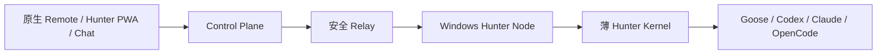

# Hunter 移动端 Coding Agent 控制面调研

> 日期：2026-07-20。事实优先来自官方文档、官方仓库和本地源码；“建议”是 Hunter 设计判断。

## 结论

最适合 Hunter 的不是单一聊天机器人，也不是立即开发原生 App，而是三层混合形态：

1. **保留 Codex、Claude 原生移动 Remote**，操作它们各自的会话、终端、diff、截图和审批。
2. **Hunter Workbench 做移动优先的 Web/PWA**，成为跨设备、跨项目、跨 Agent 的权威控制面，管理 Project、Run、Gate、Skill、Workflow、Artifact、Handoff。
3. **飞书/企业微信/Telegram 做 Channel Adapter**，仅承载通知、摘要、窄命令、低风险快捷批准和 PWA 深链。

首发建议为 **PWA + 飞书**；有中国企业用户后增加企业微信，Telegram 面向海外。原生 App 只在 PWA 被可靠推送、系统分享、语音、生物识别或后台任务明确卡住后再做。

## `lark-coding-agent-bridge`

准确上游是 [`zarazhangrui/lark-coding-agent-bridge`](https://github.com/zarazhangrui/lark-coding-agent-bridge)，MIT，2026-07 仍活跃；Hunter 分支是 [`hunterzheng1/lark-coding-agent-bridge`](https://github.com/hunterzheng1/lark-coding-agent-bridge)。依据[上游 README](https://raw.githubusercontent.com/zarazhangrui/lark-coding-agent-bridge/main/README.md)、本地源码和飞书[官方 Channel SDK](https://github.com/larksuite/node-sdk/blob/main/docs/channel.md)，其已支持：飞书 WebSocket 长连接、流式 CardKit、图片/文件、交互按钮；Claude/Codex（Hunter 分支另有 CodeBuddy）事件；单聊/群聊/topic session；`/new`、`/resume`、`/cd`、`/ws`、`/stop`；allowlist、多 profile 和 Windows Task Scheduler。

关键不足是：当前 `full/workspace/read-only` 属于启动前粗粒度权限，`full` 会映射到 Claude `bypassPermissions` 或 Codex `danger-full-access`；tool card 是观察，不是逐工具的远程审批 Gate。飞书会话还同时承担 cwd、session 和 Agent 生命周期，缺少设备注册、心跳、任务路由、跨节点交接和统一审计。

因此建议**保留但瘦身**：复用飞书认证、长连接、流式卡片、媒体、作用域和 Windows 服务经验；把 Agent 启动、session 真相、策略和审批迁到 Hunter Kernel/Control Plane，使其最终成为可替换的 `channel-feishu`。

## 原生 Remote 与参考产品

OpenAI 的 [Codex mobile Remote](https://openai.com/index/work-with-codex-from-anywhere/) 可从手机查看实时项目、终端、diff、测试、截图并批准操作；文件和凭据留在 Host，通过 secure relay 连接而不暴露公网端口。[官方发布说明](https://help.openai.com/en/articles/6825453-chatgpt-release-notes)已明确覆盖 Mac 与 Windows Host。

Anthropic 的 [Claude Remote Control](https://code.claude.com/docs/en/remote-control) 支持 iOS、Android、Web 继续本地 CLI session，只需出站 HTTPS，并有推送、重连和审批。其 [Channels 协议](https://code.claude.com/docs/en/channels-reference)值得借鉴：运行时发结构化权限请求，本地或远端均可响应，先到者有效；身份按 sender 而非仅按 room 校验。

| 产品 | 可借鉴 | 不直接采用的原因 |
|---|---|---|
| [Happy](https://github.com/slopus/happy) | MIT；Expo iOS/Android/Web、Host wrapper、relay、自托管、推送、设备交接、E2EE | 偏远程 Agent 客户端，不覆盖 Hunter 的 Workflow/Skill/Gate 治理 |
| CC Pocket | 原生移动交互、通知和触控设计 | 单客户端路线会复制厂商能力；采用前仍须核验官方仓库、许可证、Windows 与维护状态 |
| OpenACP | 协议优先、Agent/Client 解耦 | 协议兼容不等于具备设备身份、Gate、审计和离线恢复 |
| cc-connect | 聊天连接器可快速形成移动入口 | 通道不应成为状态真相，且受限流、卡片、身份和平台风控约束 |
| [CloudCLI](https://github.com/siteboon/claudecodeui) | 响应式 Web 能覆盖聊天、终端、文件、Git | AGPL，偏完整 Web IDE，攻击面和维护成本过高 |
| [OpenCode Server](https://opencode.ai/docs/server/) | OpenAPI + SSE，适合做 Kernel runtime adapter | 不应把 Basic Auth 服务端口直接暴露到互联网 |

CC Pocket、OpenACP、cc-connect 在本报告中只作形态比较，不进入首期依赖；真正采用前必须补做官方来源和代码级审计。

## 聊天、PWA、原生 App

| 方案 | 判断 |
|---|---|
| 飞书 | 中国首选快捷通道；官方 SDK 有长连接、流式卡片、文件和按钮，但不适合承载复杂 diff/测试/环境信息 |
| 企业微信 | 官方 [`aibot-node-sdk`](https://github.com/WecomTeam/aibot-node-sdk) 有长连接、流式 Markdown、模板卡片、语音/文件；作为第二中国通道 |
| Telegram | [Bot API](https://core.telegram.org/bots/api) 有 polling/webhook、inline keyboard、文件/语音；需编辑消息模拟流式，中国网络可达性是风险 |
| PWA | 一套代码覆盖桌面/移动，最适合项目、Run、证据和审批；iOS 主屏 Web App 已支持 [Web Push](https://webkit.org/blog/13878/web-push-for-web-apps-on-ios-and-ipados/)；作为权威移动工作台 |
| 原生/Expo App | 系统集成最好，但双平台维护重并重复 Codex/Claude 能力；延后 |

个人微信不作为核心面。腾讯官方 [`openclaw-weixin`](https://github.com/Tencent/openclaw-weixin)可作收发文本/图片/文件的实验参考，但它耦合 OpenClaw Host，未形成飞书式审批闭环；不使用非官方个人号 RPA 承担高风险控制。

## 推荐架构与安全边界

- **Control Plane**：保存 Device、Project、Run、Gate、Artifact、Handoff、策略和审计，不保存不必要的源码与长期 Agent 凭据。
- **Hunter Node**：只建立出站 WSS/HTTPS，上报能力与心跳；断网时本地 Run 继续，重连按序补事件；绝不开放公网 shell/OpenCode 端口。
- **Kernel**：统一 Agent adapter 与 `RunEvent`，执行本地策略；厂商原生 session 只保存引用，允许跳回原生端。
- **PWA**：负责 Host→Project→Agent/Workflow 选择、时间线、diff/测试/截图、审批与交接。
- **Channel Adapter**：只投影状态和提交窄命令；机器人离线不影响 Run 真相。

远程审批必须是一等 `Gate`，绑定 `run_id`、精确 action/payload hash、cwd、目标环境、风险、证据、一次性 nonce、过期时间、approver user/device 和审计序号。多入口只能有一个原子生效。低风险可在私聊卡片批准；生产、删除、secret、发布、付费操作必须跳 PWA 查看完整证据并二次认证。Bot 不持有 Agent 长期凭据、不直连 shell；必须校验具体 sender、tenant 与 Hunter User，不能只信任群 ID。

**最终决策：先将现有飞书桥拆成 Channel Adapter，同时建设最小 Hunter Node、Run/Gate 协议和移动 PWA；继续使用 Codex/Claude 原生 Remote。暂不开发独立原生 App，也不让任何聊天平台成为执行状态数据库。**
