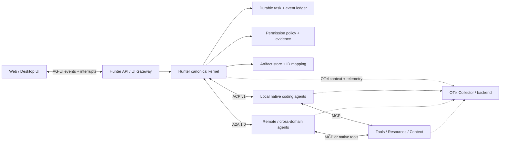

# Hunter 多原生 Agent 控制平面：协议与基础设施调研

> **支持性快照**：协议会持续演进。实施时必须固定版本并以
> [`2026-07-21-hunter-platform-landscape-and-reuse.md`](2026-07-21-hunter-platform-landscape-and-reuse.md)
> 的当前综合结论和 Phase 0 capability negotiation 为准。

> 调研日期：2026-07-21
> 范围：ACP、MCP、A2A、AG-UI、OpenTelemetry GenAI/Trace 及其直接依赖标准
> 资料原则：只引用规范、官方文档与官方仓库；稳定性判断以调研日公开状态为准。

## 1. 执行结论

Hunter 不应自创一个同时覆盖本地 coding agent、工具调用、远程 agent 协作、前端事件和可观测性的单体协议。现有标准已经形成清晰但彼此不重叠的分层：

| 层次 | 建议采用 | Hunter 中的角色 |
|---|---|---|
| 本地原生 coding agent 控制 | **ACP v1** | 首选本地 Adapter wire：会话、prompt turn、流式更新、工具展示、终端/文件系统、用户授权 |
| 工具与上下文接入 | **MCP 2025-11-25** | 统一工具、资源、提示词和模型采样边界；不是 agent 控制协议 |
| 跨进程/跨网络 agent 委派 | **A2A 1.0** | 远程 agent gateway：发现、任务、流式状态、产物、订阅与委派 |
| 用户界面实时投影 | **AG-UI** | Web/桌面端的运行、消息、工具、状态和中断事件；不是控制平面的事实源 |
| 端到端遥测 | **OpenTelemetry + W3C Trace Context/Baggage** | 横切所有边界的 trace、metric、log 与上下文传播；不是业务状态机 |

推荐组合是：**ACP 管本地 agent，MCP 管工具，A2A 管远程委派，AG-UI 管前端投影，OpenTelemetry 管观测**。这五者不是互斥选项，也没有任何一个足以单独成为 Hunter 的完整控制平面。

组合采用仍然需要一个很小的 Hunter 内部内核，但它应是私有、可版本化的 canonical model / SPI，而不是再发明一个生态 wire protocol。这个内核只承担各协议无法共同保证的语义：

- 稳定的 `session_id`、`run_id/task_id`、`event_id`、`artifact_id` 及外部 ID 映射；
- 可恢复的任务状态机、追加式事件账本、幂等键、租约与重试；
- 统一的 fail-closed 权限决策与审批证据；
- 持久化 artifact/evidence 引用及内容寻址；
- 跨 ACP/A2A/AG-UI/OTel 的 trace 关联，但绝不把 trace ID 当业务 ID；
- 保存 `source_protocol`、`source_version`、外部 ID 与必要的原始 payload，避免归一化丢失信息。

## 2. 协议定位与能力矩阵

下表中的“任务”指可查询、可恢复、独立于单次请求连接的 durable task；“授权”指工具/副作用执行前的结构化 allow/reject 决策，而非仅认证或向用户提问。

| 协议 | 主要层次 | Session/上下文 | Durable task | 流式事件 | Tool | 授权 | Artifact | Handoff/委派 | Hunter Adapter contract 适配度 |
|---|---|---|---|---|---|---|---|---|---|
| ACP v1 | 编辑器/客户端 ↔ 本地 coding agent | **强**：session 生命周期与恢复 | **弱**：v1 以 prompt turn 为核心，缺少独立 durable task | **强**：`session/update`、取消、stop reason | **强**：工具状态、内容、diff、terminal | **强**：一次/永久允许或拒绝 | 中：内容、diff、resource；无 durable artifact store | 无 peer-agent handoff | **本地 Adapter wire 首选** |
| MCP 2025-11-25 | AI 应用 ↔ 工具/资源/上下文服务 | 中：连接/HTTP session，不是对话 session | 中/实验：Tasks 为 experimental | 中：progress、通知、task 轮询 | **强**：标准核心 | 弱：OAuth 是传输认证；annotations 非强制策略；elicitation 不是工具审批 | 弱：resource/content，不是产物仓库 | 无 | **工具子系统 contract 首选，不适合作 agent contract** |
| A2A 1.0 | agent ↔ 远程 agent | **强**：`contextId` 聚合消息和任务 | **强**：Task 状态机、查询、取消、订阅 | **强**：SSE、push notification、顺序事件 | 间接：技能/消息，不暴露执行细节 | 中弱：认证成熟，`AUTH_REQUIRED` 通用；细粒度审批策略未规定 | **强**：一等 Artifact/Part，可流式更新 | **强**：协议核心用途，但无原子所有权转移事务 | **远程 gateway 首选，不适合本地 coding 控制** |
| AG-UI | agent backend ↔ 用户应用 | **强（UI 语义）**：`threadId` | 弱：`runId` 是运行投影，不是 durable task store | **强**：生命周期、文本、工具、状态、custom/raw | **强（展示/交互）** | 中/草案：interrupt/HITL 可确认或修改，但相关能力仍在演进 | 弱：消息/状态/工具结果，无持久产物模型 | 中：能表达多 agent/handoff UI，不能执行分布式交接 | **北向 UI event contract 首选** |
| OpenTelemetry GenAI | 全栈遥测 | 仅 attribute：`gen_ai.conversation.id` | 无 | Span/event/log，不是业务事件 | **强（观测）**：execute-tool spans/attributes | 无 | 无 | 仅 trace/link 关联 | **横切观测 contract；不能控制 agent** |

### 2.1 同名概念不能直接等同

| Hunter canonical 概念 | ACP | MCP | A2A | AG-UI | OpenTelemetry |
|---|---|---|---|---|---|
| Session/Conversation | `sessionId` | transport session；不是对话 | `contextId` | `threadId` | `gen_ai.conversation.id` attribute |
| Run/Task | v1 prompt turn；没有稳定的一等 task ID | experimental Task `taskId` | `taskId` | `runId` | span ID 仅用于遥测 |
| Event | `session/update` notification | JSON-RPC notifications/progress | task/status/artifact streaming event | `BaseEvent` 家族 | span event/log |
| Tool call | tool call/update + client fs/terminal | `tools/call` | 通常封装在远程 agent 内部 | tool-call start/args/end/result | `execute_tool` span/attributes |
| Permission | `session/request_permission` | 无统一工具审批；elicitation 是用户输入 | `AUTH_REQUIRED`/`INPUT_REQUIRED`，细则由实现决定 | interrupt/confirmation（演进中） | 无 |
| Artifact | content/diff/resource | content/resource | 一等 `Artifact` + `Part` | UI state/message/tool result | 无 |

因此 Adapter 必须显式维护映射，不能通过字段改名假装语义一致。尤其是 `OTel span_id`、AG-UI `runId` 与 Hunter durable `task_id` 的生命周期完全不同。

## 3. ACP：本地原生 coding agent 的最佳直接边界

### 3.1 层次与语义覆盖

[ACP v1](https://agentclientprotocol.com/protocol/v1/overview) 定位为代码编辑器/IDE 与 coding agent 之间的标准协议。客户端提供文件系统、终端与权限交互，agent 处理 prompt 并持续发送会话更新。这与 Hunter 适配“原生 agent 进程”的边界最接近。

- **Session**：初始化和 capability negotiation 后，支持创建、加载、恢复、列举、关闭和删除 session；同一连接可承载多个 session。新建 session 时可传工作目录和 MCP server 配置。[Session setup](https://agentclientprotocol.com/protocol/v1/session-setup)
- **Turn/Event**：客户端调用 `session/prompt`，agent 通过 `session/update` 推送文本、思考、计划、工具调用等增量，最后以 stop reason 结束；支持取消。[Prompt turn](https://agentclientprotocol.com/protocol/v1/prompt-turn)
- **Tool**：`tool_call` / `tool_call_update` 描述 pending、in-progress、completed、failed 状态，内容可包含普通内容、文件 diff、terminal 和 location。[Tool calls](https://agentclientprotocol.com/protocol/v1/tool-calls)
- **Permission**：`session/request_permission` 是本次调研中最贴近 coding agent 风险控制的一等机制。选项可表达 `allow_once`、`allow_always`、`reject_once`、`reject_always`，响应为选中或取消；客户端也可按策略自动决策。
- **Filesystem/Terminal**：agent 可以请求客户端读写文本文件、创建终端、读取输出、等待退出和释放终端。[Terminal methods](https://agentclientprotocol.com/protocol/v1/terminals)
- **Artifact/Handoff**：diff、resource 与工具内容可承载结果，但没有独立、持久、可寻址的 artifact repository；也没有 peer-agent handoff。

ACP v1 的关键缺口是没有独立于 `session/prompt` 请求生命周期的一等 durable task。v2 的 [Prompt lifecycle RFD](https://agentclientprotocol.com/rfds/v2/prompt) 正在设计 out-of-turn/background、`running`/`idle`/`requires_action` 等状态，这反过来说明 Hunter 不能提前把 v2 草案能力当成 v1 保证。

### 3.2 传输、Schema、SDK 与许可证

- 基于 JSON-RPC 2.0；v1 标准传输是 UTF-8 NDJSON over stdio。自定义传输允许存在，但 [Streamable HTTP/WebSocket](https://agentclientprotocol.com/rfds/streamable-http-websocket-transport) 仍是 RFD，不是 v1 稳定基线。[Transports](https://agentclientprotocol.com/protocol/v1/transports)
- 规范提供机器可读 [schema](https://agentclientprotocol.com/protocol/v1/schema)，初始化时协商 `protocolVersion` 和 capabilities。
- [官方仓库](https://github.com/agentclientprotocol/agent-client-protocol) 采用 Apache-2.0；提供 Kotlin、Java、Python、Rust、TypeScript SDK。协议版本当前为稳定 `1`，SDK/仓库 release 与 wire protocol 版本需要分开管理。
- 治理目前由 Zed 与 JetBrains 联合推动，并计划转入更独立的治理结构。[Governance](https://agentclientprotocol.com/community/governance)

### 3.3 真实 coding-agent 采用与稳定性

官方 [Agents 目录](https://agentclientprotocol.com/get-started/agents) 列出 Gemini CLI、Goose、OpenCode、Kiro、Cursor、GitHub Copilot preview 等原生/官方接入；Claude 与 Codex 有 `claude-agent-acp`、`codex-acp` adapter。官方组织也维护这些桥接仓库，[Clients 目录](https://agentclientprotocol.com/get-started/clients) 则覆盖 Zed、JetBrains、Neovim、VS Code 扩展及多个桌面客户端。

这说明 ACP 已有真实 coding-agent 互操作价值，而非只有概念样例。不过应区分：

- 原生实现与第三方/官方组织 adapter 的能力保真度不同；
- v1 核心可作为生产基线，v2 与远程 transport 仍应 feature flag；
- 每个 agent 的 capability、恢复语义、权限选项和工具内容仍须 conformance test，不能只凭“支持 ACP”判断等价。

### 3.4 对 Hunter 的判定

**采用：是，作为本地原生 agent Adapter 的首选 wire contract。** Hunter 应 pin ACP v1，通过 capability negotiation 开启可选能力，并保存协议版本/原始事件。

**不能解决：**远程不可信网络上的认证与重连、跨 agent 委派、durable task/event ledger、artifact store、全局调度、公平性、资源配额、审批策略权威和审计证据。这些仍属于 Hunter 内核或 A2A/OTel 等其他层。

## 4. MCP：统一工具与上下文，不是 agent 控制协议

### 4.1 层次与语义覆盖

[MCP 架构](https://modelcontextprotocol.io/docs/learn/architecture) 将 host、client、server 分离：server 暴露 tools、resources、prompts，client 还可提供 sampling、roots、elicitation 等能力。它解决的是“模型/agent 如何安全、可发现地接入能力和上下文”，而非“如何操控完整 coding agent 会话”。

- **Session**：stdio 连接或 Streamable HTTP session 具有生命周期与 capability negotiation，但 HTTP 的 `MCP-Session-Id` 是传输会话，不等于用户对话或 agent session。
- **Task**：2025-11-25 引入的 [Tasks](https://modelcontextprotocol.io/specification/2025-11-25/basic/utilities/tasks) 可把请求包装为可查询、列举、取消、取结果的状态机，并要求绑定认证上下文；但规范明确标为 **experimental**。工具可声明 task support 为 required/optional/forbidden，Tier 1 SDK 完整性也不要求 experimental Tasks。
- **Event**：JSON-RPC notification、progress 与 task polling/结果能够表达执行进展，但没有 coding turn 的标准事件词汇。
- **Tool**：这是 MCP 最强的部分。`tools/list` / `tools/call` 使用 JSON Schema 描述输入输出和结构化/非结构化内容。
- **Permission**：HTTP authorization 主要解决客户端对 server 的 OAuth 授权；stdio 凭证来自环境。[Elicitation](https://modelcontextprotocol.io/specification/2025-11-25/client/elicitation) 用于结构化用户输入或 URL 流程。二者都不等于执行某个高风险 tool 前的统一 allow/reject 合约。`readOnlyHint`、`destructiveHint`、`idempotentHint`、`openWorldHint` 只是不可盲信的 annotations，不能充当策略执行。
- **Artifact/Handoff**：resource/content 可传数据，却没有 durable artifact lineage；也没有 agent-to-agent handoff。

### 4.2 传输、Schema、SDK 与许可证

- [2025-11-25 transports](https://modelcontextprotocol.io/specification/2025-11-25/basic/transports) 规定 UTF-8 JSON-RPC 2.0 over stdio 或 Streamable HTTP；HTTP 可使用 session ID，并有明确的 Origin、认证与安全要求。
- [Schema](https://modelcontextprotocol.io/specification/2025-11-25/schema) 为机器可读规范；工具输入输出使用 JSON Schema，默认方言为 2020-12。
- [官方仓库](https://github.com/modelcontextprotocol/modelcontextprotocol) 采用 MIT。官方 [SDK 列表](https://modelcontextprotocol.io/docs/sdk) 覆盖 TypeScript、Python、C#、Go、Java、Rust、Swift、Ruby、PHP、Kotlin；[SDK tiers](https://modelcontextprotocol.io/community/sdk-tiers) 明确 Tier 1/2/3 的维护和一致性要求。
- 当前稳定规范版本为 [2025-11-25](https://modelcontextprotocol.io/specification/2025-11-25)，但单项 experimental feature 仍必须单独判断，不能由总版本号推导成熟度。

### 4.3 真实 coding-agent 采用与稳定性

MCP 已是本次调研中最广泛的 coding-agent 工具扩展接口：

- [OpenAI Codex 官方仓库](https://github.com/openai/codex/blob/main/codex-rs/README.md) 说明 Codex CLI 可作为 MCP client，并提供实验性的 MCP server 模式；
- [Claude Code 官方文档](https://docs.anthropic.com/en/docs/claude-code/mcp) 提供 MCP server 的连接、作用域与管理；
- [Gemini CLI 官方仓库](https://github.com/google-gemini/gemini-cli) 将 MCP server 作为扩展工具来源；
- [VS Code 官方文档](https://code.visualstudio.com/docs/copilot/chat/mcp-servers) 支持在 agent 模式和 coding agent 场景使用 MCP server。

核心 tools/resources/prompts 与 stdio/HTTP 已适合作稳定生产接口；Tasks 应以实验能力处理，建立降级路径，不能成为 Hunter 第一阶段 durable task 的唯一存储。

### 4.4 对 Hunter 的判定

**采用：是，作为统一工具、资源和上下文 contract。** Hunter 应把 MCP server inventory、capability discovery、tool schema 和调用关联接入其策略与审计层。

**不采用：把“agent 包成一个 MCP tool”作为完整 Adapter contract。** 这种封装会丢失 session 恢复、细粒度流式事件、工具审批、终端/diff 语义与 agent 能力协商。

**不能解决：**完整 agent session、coding turn、调度、可靠事件重放、细粒度权限权威、artifact store 与 agent handoff。

## 5. A2A：跨网络 agent 委派与任务交换

### 5.1 层次与语义覆盖

[A2A 1.0 规范](https://a2a-protocol.org/latest/specification/) 面向独立 agent 之间的发现、消息、长任务协作和产物交换。它刻意允许远端 agent 保持实现不透明，这与跨组织/跨信任域委派吻合，但与 IDE 需要观察 terminal、diff 和每次工具审批的本地控制不同。

- **Discovery**：Agent Card（通常位于 `/.well-known/agent-card.json`）发布技能、能力、接口与 security schemes。
- **Session/Context**：`contextId` 聚合同一交互上下文中的 Message 与 Task，可跨多个任务。
- **Task**：一等 `Task`、`TaskStatus` 与状态机；支持发送消息、流式发送、查询、列举、取消、订阅和 push notification。状态包括 submitted、working、completed、failed、canceled、rejected、input-required、auth-required。
- **Event**：SSE streaming 与 webhook push 支持 task status 和 artifact 增量；规范定义有序事件及多客户端订阅行为。
- **Tool**：Agent Card 的 skill 是高层能力，不要求暴露 agent 内部 tool call。因此 A2A 能委派工作，却不是细粒度工具控制协议。
- **Permission/Auth**：使用标准 Web security schemes、TLS、OAuth/OIDC 等进行身份认证和授权检查。`AUTH_REQUIRED`、`INPUT_REQUIRED` 能让客户端补充认证或人类输入，但 allow-once/allow-always 等工具审批语义与策略执行仍由实现/扩展决定。
- **Artifact**：一等 `Artifact` 由多个 `Part` 组成，可随执行流式追加或更新，是五项协议中最完整的任务产物模型。
- **Handoff**：通过 Agent Card 发现和 Message/Task 完成委派是核心用途；但协议没有提供一个跨控制面的原子“所有权转移事务”，Hunter 仍需记录委派边、幂等性和补偿动作。

### 5.2 传输、Schema、SDK 与许可证

- 规范分数据模型、抽象操作和 protocol binding 三层；规范仓库中的 `specification/a2a.proto` 是 canonical 数据定义。
- 官方 bindings 包括 JSON-RPC、gRPC 和 HTTP+JSON/REST；流式结果通常经 SSE，异步通知可用 webhook。
- [A2A 官方组织](https://github.com/a2aproject) 归属 Linux Foundation，规范与 SDK 采用 Apache-2.0；提供 Python、JavaScript、Java、Go、C#/.NET、Rust SDK，并维护 TCK、Inspector 和 samples。
- 1.0 已形成正式规范和兼容性工具，适合在清晰的网络/信任边界试点；不同 binding、扩展和 Agent Card 能力仍需 conformance 与安全测试。

### 5.3 真实 coding-agent 采用与稳定性

在本次调查的原生 coding agent 中，公开的一手采用证据以 Gemini CLI 最明确：其官方 changelog 已记录 A2A remote agents 的 HTTP 认证与 authenticated Agent Card，官方 telemetry 文档也区分 A2A server 运行形态；官方讨论中还有面向开发工具的 A2A extension 设计。[Gemini CLI changelog](https://github.com/google-gemini/gemini-cli/blob/main/docs/changelogs/index.md)

相比 ACP/MCP，A2A 在 Codex、Claude Code、Goose、OpenCode 等原生 coding-agent 本地控制路径上的直接采用仍较弱。这里不是否定 A2A 成熟度，而是说明它的目标层本来就是远程 agent 互操作，不应为了“协议统一”强行替换 ACP。

### 5.4 对 Hunter 的判定

**采用：是，作为跨进程/跨网络/跨信任域的 remote-agent gateway。** 内部同机原生 agent 优先 ACP；只有越过明确边界时才转换为 A2A Task/Artifact。

**不能解决：**编辑器文件系统和 terminal 接口、diff 展示、逐工具审批、原生 agent 的精细 prompt-turn 事件、Hunter 的调度/租约/重试策略、artifact 的长期存储和原子 handoff。

## 6. AG-UI：前端事件与 Human-in-the-loop 投影

### 6.1 层次与语义覆盖

[AG-UI](https://docs.ag-ui.com/) 是 agent backend 与用户应用之间的轻量事件协议。其核心抽象是 `run(RunAgentInput) -> Observable<BaseEvent>`；标准 `HttpAgent` 使用 HTTP POST + SSE，也允许 WebSocket、webhook 或自定义二进制传输。[Architecture](https://docs.ag-ui.com/concepts/architecture)

[标准事件](https://docs.ag-ui.com/concepts/events) 包括：

- Run/Step started、finished、error 等生命周期事件；
- text message start/content/end；
- tool-call start/args/end/result；
- state snapshot 与 RFC 6902 JSON Patch delta；
- messages snapshot、raw 和 custom events；
- `threadId`、`runId`、`parentRunId`、事件 ID 与排序约束。

[Capabilities](https://docs.ag-ui.com/concepts/capabilities) 可声明 transport、tools、output、state、multi-agent、reasoning、multimodal、execution、HITL 等可选能力，但文档明确它更接近动态发现而非严格协商。

[Interrupts](https://docs.ag-ui.com/concepts/interrupts) 能表达 input-required、confirmation、tool-call 审批、approve-with-edits，并通过同一 thread 的下一次输入恢复。不过相关 interrupt outcome/修改后的 lifecycle 在事件文档中仍带有 draft/演进信号，因此 Hunter 不能把它作为唯一审批事实源。

AG-UI 的 multi-agent/handoff 能很好地向 UI 表达父子运行、委派与控制权变化，但不负责远程 agent 的发现、可靠交付或原子所有权转移。它也没有 durable task store 和 artifact repository。

### 6.2 传输、Schema、SDK、许可证与采用

- 默认 HTTP + SSE，事件是强类型数据模型；状态增量遵循 RFC 6902 JSON Patch，允许 raw/custom 兼容扩展。
- [官方仓库](https://github.com/ag-ui-protocol/ag-ui) 采用 MIT，包含 TypeScript/Python 核心实现与多语言、框架集成材料。
- [官方 integrations](https://docs.ag-ui.com/integrations) 覆盖 LangGraph、Microsoft Agent Framework、Google ADK、AWS Strands、Mastra、Pydantic AI 等 agent framework，CopilotKit 是其主要前端生态。
- 目前没有足够一手证据表明 Codex、Claude Code、Goose、OpenCode 等把 AG-UI 当作原生进程控制 wire；“用 Cursor 开发 AG-UI”之类教程也不等于 coding agent 采用协议。

### 6.3 对 Hunter 的判定

**采用：是，作为北向 Web/桌面 UI 的 normalized event contract。** Hunter 可把内部账本、ACP updates 与 A2A task events 投影成 AG-UI，并让 UI 通过 interrupt 呈现审批/补充输入。

**不能解决：**可靠任务执行、调度、权限策略权威、artifact 生命周期、远程 agent 认证与委派、事件永久存储。AG-UI event 是投影，不应反向成为控制平面事实源。

## 7. OpenTelemetry GenAI/Trace：跨协议关联，而非控制

### 7.1 层次与语义覆盖

[OpenTelemetry 核心规范](https://opentelemetry.io/docs/specs/otel/) 为 trace、metric、log、Context 和传播提供跨语言标准；核心 trace/context API/SDK 已稳定。GenAI semantic conventions 已移至官方独立仓库 [semantic-conventions-genai](https://github.com/open-telemetry/semantic-conventions-genai)，采用 Apache-2.0。

GenAI conventions 已定义或正在定义：

- `create_agent`、`invoke_agent`、`invoke_workflow`、`plan` 等 [agent spans](https://github.com/open-telemetry/semantic-conventions-genai/blob/main/docs/gen-ai/gen-ai-agent-spans.md)；
- `gen_ai.agent.id/name/version`、`gen_ai.conversation.id`、`gen_ai.operation.name`；
- `execute_tool`、tool call ID、参数/结果、模型 token usage 等；
- [MCP spans](https://github.com/open-telemetry/semantic-conventions-genai/blob/main/docs/gen-ai/mcp.md) 中的 method、session ID、protocol version 与 JSON-RPC 属性。

但 agent spans 与 MCP GenAI conventions 当前状态仍是 **Development**。Hunter 应 pin semantic-convention/schema 版本，在 exporter 层兼容升级；prompt、tool arguments/results 等高基数或敏感内容必须 opt-in、脱敏和限量。

传播层应采用 W3C Trace Context 的 `traceparent` / `tracestate` 与 W3C Baggage。MCP 已有 final 的 [SEP-414 request metadata](https://modelcontextprotocol.io/seps/414-request-meta) 约定 `_meta.traceparent`、`tracestate`、`baggage`，并指出 ACP 有等价方向。这适合把 UI → Hunter → ACP/A2A → MCP tool 的因果链串起来。

### 7.2 SDK、许可证与真实采用

- OpenTelemetry 规范和绝大多数官方 SDK 使用 Apache-2.0，拥有成熟的多语言 SDK、Collector 和 exporter 生态。
- [Gemini CLI 官方 telemetry 文档](https://github.com/google-gemini/gemini-cli/blob/main/docs/cli/telemetry.md) 已输出 logs、metrics、traces，并对齐 GenAI semantic conventions，例如用 `gen_ai.conversation.id` 表示 CLI session、记录 tool spans。
- [GitHub Agentic Workflows 官方指南](https://github.github.com/gh-aw/guides/open-telemetry/) 也以 OpenTelemetry 观测 agentic workflow，表明它已经进入真实 agent/coding workflow 基础设施。

### 7.3 对 Hunter 的判定

**采用：是，作为所有 Adapter 的强制横切 contract。** 每次 ingress 创建/接续 context；同步调用用 parent-child，异步队列、重试和 handoff 使用 span links；业务事件保存 trace/span 关联。

**不能解决：**任何 session/task 状态机、命令传递、取消、权限、artifact、handoff 或重试。OTel 数据可采样、丢失和过期，所以绝不能代替 Hunter 审计账本；trace ID 也绝不能代替 task/session/artifact ID。

## 8. 推荐的 Hunter 组合架构

### 8.1 最小内部 Adapter SPI

Hunter 内部接口宜保持窄小，表达最小公共控制语义，而不是复制所有外部协议：

1. **Identity & capabilities**：adapter/agent/version、source protocol/version、原生 capability 集合。
2. **Session lifecycle**：create/load/resume/close，工作目录和安全边界；不支持的操作显式返回 capability error。
3. **Run/task lifecycle**：submit、cancel、query、subscribe；Hunter 自己生成 durable ID，并保存 ACP prompt turn、A2A task、AG-UI run 的外部映射。
4. **Normalized event envelope**：单调序号、时间、session/task、source、kind、payload、trace context；保留 raw payload 引用。
5. **Permission request/resolution**：以 ACP 的丰富选项为起点，但由 Hunter policy engine 最终决策；MCP annotations 只能作为输入信号。
6. **Artifact reference**：ID、media type、digest、size、producer task、lineage、URI/inline policy；A2A Artifact、ACP diff/content、MCP resource 都映射为引用而非无界内嵌。
7. **Handoff edge**：source/target agent、parent/child task、reason、capability、deadline、idempotency key、status；A2A 是远程执行载体，Hunter 记录权威委派关系。
8. **Trace carrier**：W3C context 注入/提取与 OTel attributes；和业务 ID 分离。

内部状态机应采用保守的最小集合，例如 `queued → running → requires_action → succeeded|failed|canceled`。协议特有状态保存为 `source_status`，不能不可逆地压平；未知状态默认不可自动推进高风险动作。

### 8.2 权限模型的特别处理

权限是五项协议中最不收敛的部分：

- ACP 有最具体的 coding-agent 请求/决策交互；
- MCP 的 OAuth、elicitation、tool annotations 各解决不同问题，均不是策略权威；
- A2A 的 `AUTH_REQUIRED`/`INPUT_REQUIRED` 是通用任务状态；
- AG-UI interrupt 适合展示和收集选择，但相关规范仍在演进；
- OTel 只能记录决策，不能作出决策。

因此 Hunter 必须保留唯一的 permission decision service 和不可变审批证据。Adapter 的职责只是翻译请求与结果。语义不确定、连接断开、选项无法映射或审批过期时必须 fail closed。

## 9. 分阶段采用建议

### Phase 0：先建立可验证内核

- canonical IDs、外部 ID 映射、追加式事件账本、幂等和恢复；
- permission decision/evidence 与 artifact reference；
- OTel context propagation，pin GenAI semantic-convention 版本并默认关闭敏感内容采集。

### Phase 1：ACP v1 本地适配

- 优先覆盖 create/load/resume、prompt/update/cancel、tool/diff/terminal、permission；
- 对每个 agent 建 capability matrix 与 golden trace；
- v2 background/out-of-turn 和 HTTP transport 仅实验开关，不污染 v1 contract。

### Phase 2：MCP 工具治理

- inventory、schema validation、server trust、OAuth/credential isolation、调用审计；
- tool annotations 只作为风险信号；高风险工具仍走 Hunter permission；
- MCP Tasks 作为可选优化，不作 durable task 唯一来源。

### Phase 3：AG-UI 北向投影

- 从 Hunter 账本确定性生成 run/message/tool/state events；
- interrupt 只负责 UI 往返，最终 decision 写回 Hunter；
- 对断线重连提供 Hunter event cursor，不能只依赖短生命周期 SSE。

### Phase 4：A2A 远程边界

- 仅在跨进程、跨主机或跨信任域场景启用；
- 校验 Agent Card、TLS/OAuth、webhook 防重放与任务级授权；
- Artifact 入 Hunter store，handoff 使用幂等键、超时、补偿与 lineage。

## 10. 兼容性与验收重点

组合方案能否落地，取决于 contract tests 而非只看协议声明。至少覆盖：

- session/task/run ID 在创建、恢复、重试、重连和 adapter 重启后的映射不漂移；
- 事件重复、乱序、断流、取消与迟到 completion 的确定性处理；
- ACP permission 四类选择到 Hunter policy 的无损映射与 fail-closed 降级；
- MCP tool schema、结构化输出、超时、experimental Task 缺失时的降级；
- A2A Task/Artifact 增量、SSE 重连、push 重放、认证过期和重复 handoff；
- AG-UI state patch 基线丢失、interrupt 过期与 UI 重连；
- W3C context 在 stdio、HTTP、SSE、队列和 webhook 上的传播，异步边界使用 span links；
- 禁止把 OTel 采样数据当审计事实，禁止把外部状态不可逆压平成 Hunter 状态。

## 11. 最终判断

1. **ACP v1 可以成为 Hunter 本地原生 coding-agent Adapter 的直接协议基础**，这是五者中唯一同时理解 session、prompt turn、工具展示、终端/文件系统和细粒度权限交互的协议。
2. **MCP 必须采用，但只放在工具/上下文层**。它的广泛 coding-agent 采用是优势，把它上升为完整 agent 控制面则会丢失关键语义。
3. **A2A 1.0 应作为远程委派边界**。其 durable Task、Artifact、发现和网络绑定优于 ACP，但不适合取代 ACP 的本地交互控制。
4. **AG-UI 应作为 UI 投影层**，提供丰富流式体验和 HITL 展示；它不应持有任务、权限或审计的权威状态。
5. **OpenTelemetry + W3C propagation 应从第一天横切接入**，但 GenAI semantic conventions 仍在 Development，必须版本固定、隐私默认关闭、与业务 ID/审计账本分离。
6. **Hunter 仍需一个最小内部 canonical kernel**。这不是“再造协议”，而是必要的语义防腐层：不同标准在 session/task/event/permission/artifact/handoff 上没有共同的强保证。公开 wire 尽量采用标准，内部只保留可靠控制所必需的状态与映射。

## 12. 主要一手资料索引

### ACP

- [ACP v1 Overview](https://agentclientprotocol.com/protocol/v1/overview)
- [ACP v1 Transports](https://agentclientprotocol.com/protocol/v1/transports)
- [ACP v1 Session setup](https://agentclientprotocol.com/protocol/v1/session-setup)
- [ACP v1 Prompt turn](https://agentclientprotocol.com/protocol/v1/prompt-turn)
- [ACP v1 Tool calls](https://agentclientprotocol.com/protocol/v1/tool-calls)
- [ACP v1 Schema](https://agentclientprotocol.com/protocol/v1/schema)
- [ACP Agents / Clients](https://agentclientprotocol.com/get-started/agents)
- [ACP official repository](https://github.com/agentclientprotocol/agent-client-protocol)
- [ACP v2 Prompt lifecycle RFD](https://agentclientprotocol.com/rfds/v2/prompt)

### MCP

- [MCP Specification 2025-11-25](https://modelcontextprotocol.io/specification/2025-11-25)
- [MCP Architecture](https://modelcontextprotocol.io/docs/learn/architecture)
- [MCP Transports](https://modelcontextprotocol.io/specification/2025-11-25/basic/transports)
- [MCP Tasks](https://modelcontextprotocol.io/specification/2025-11-25/basic/utilities/tasks)
- [MCP Authorization](https://modelcontextprotocol.io/specification/2025-11-25/basic/authorization)
- [MCP Elicitation](https://modelcontextprotocol.io/specification/2025-11-25/client/elicitation)
- [MCP SDKs and tiers](https://modelcontextprotocol.io/docs/sdk)
- [MCP official repository](https://github.com/modelcontextprotocol/modelcontextprotocol)

### A2A

- [A2A 1.0 Specification](https://a2a-protocol.org/latest/specification/)
- [A2A official organization, SDKs, TCK and samples](https://github.com/a2aproject)
- [A2A canonical specification repository](https://github.com/a2aproject/A2A)

### AG-UI

- [AG-UI documentation](https://docs.ag-ui.com/)
- [AG-UI Architecture](https://docs.ag-ui.com/concepts/architecture)
- [AG-UI Events](https://docs.ag-ui.com/concepts/events)
- [AG-UI Capabilities](https://docs.ag-ui.com/concepts/capabilities)
- [AG-UI Interrupts](https://docs.ag-ui.com/concepts/interrupts)
- [AG-UI official repository](https://github.com/ag-ui-protocol/ag-ui)

### OpenTelemetry 与基础标准

- [OpenTelemetry Specification](https://opentelemetry.io/docs/specs/otel/)
- [OpenTelemetry Semantic Conventions](https://opentelemetry.io/docs/specs/semconv/)
- [OpenTelemetry GenAI semantic conventions repository](https://github.com/open-telemetry/semantic-conventions-genai)
- [GenAI agent spans](https://github.com/open-telemetry/semantic-conventions-genai/blob/main/docs/gen-ai/gen-ai-agent-spans.md)
- [MCP semantic conventions](https://github.com/open-telemetry/semantic-conventions-genai/blob/main/docs/gen-ai/mcp.md)
- [MCP SEP-414 trace context propagation](https://modelcontextprotocol.io/seps/414-request-meta)
- [JSON-RPC 2.0](https://www.jsonrpc.org/specification)
- [JSON Schema 2020-12](https://json-schema.org/draft/2020-12)
- [RFC 6902 JSON Patch](https://datatracker.ietf.org/doc/html/rfc6902)
- [W3C Trace Context](https://www.w3.org/TR/trace-context-2/)
- [W3C Baggage](https://www.w3.org/TR/baggage/)
