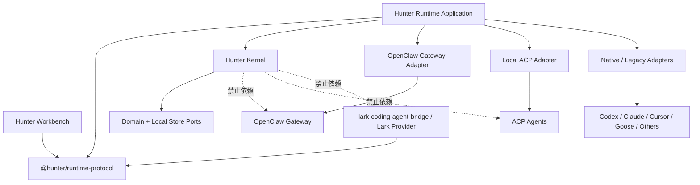

# Hunter 现有资产复用地图：面向 OpenClaw / ACP 的重构建议

> **历史路线建议（已被取代）**：本文的源码资产观察可作为迁移取材，但
> OpenClaw/ACP 重构目标、旧 Workbench/Runtime 拆分和旧领域命名不定义当前
> Hunter Platform。当前仓库边界与复用路线见
> [`../09-migration-and-roadmap.md`](../09-migration-and-roadmap.md) 和
> [`2026-07-21-hunter-platform-landscape-and-reuse.md`](2026-07-21-hunter-platform-landscape-and-reuse.md)。

> 调研日期：2026-07-21
> 调研范围：本机三个仓库的当前源码，仅做只读分析，不评价尚未落地的愿景文档。
> 基线：Hunter-Harness `009cd28`；Hunter-Runtime `c8ee05e`；lark-coding-agent-bridge `975e4bf`。
> 目标：回答新版 Hunter 采用 OpenClaw / ACP 后，什么应保留、迁移、重构或退役，以及仓库边界和依赖方向应如何调整。

## 1. 结论先行

不建议把三个仓库合并后继续堆功能，也不建议为了接入 OpenClaw 而推倒重来。现有资产正好覆盖三个相互独立的价值层：

1. **Hunter-Harness 已经是 Workbench 的雏形**：它有技能/工作流注册表、发布制品、项目 Proposal/Review/Artifact/Audit、知识索引、敏感信息检查和多 Agent 文件投影。这些是 Hunter 的长期差异化能力，不应交给 OpenClaw。
2. **Hunter-Runtime 已经是 Governance Kernel 的实验实现**：动作哈希、fingerprint、Local Policy、Gate 双 TTL、一次性消费、恢复日志、workspace lease 和 Windows 进程监管应保留；Goose 专用命名与接入层应泛化。
3. **lark-coding-agent-bridge 是成熟的飞书体验与本地 CLI 兼容实现**：其中有可复用的会话目录、进程队列、事件归一化、卡片状态机、回调签名和 Windows 原子写；但其主流程与飞书 SDK、具体 CLI 强耦合，不应整体并入 Runtime。
4. **OpenClaw / ACP 应作为执行与渠道底座，不应成为 Hunter 的领域核心**：Hunter 的 WorkItem、Run、Gate、Evidence、Artifact、Knowledge 不能以 OpenClaw session 或 ACP session 为主键，也不能依赖 OpenClaw 内部数据库结构。

建议的总体动作是：

- 将当前 Hunter-Harness 演进并改名为 **Hunter Workbench**；
- 在当前 Hunter-Runtime 仓库继续提炼 **Hunter Runtime + Hunter Kernel**，不另开第三套实现；
- lark-coding-agent-bridge 保持独立，短期作为 **兼容渠道和回归基准**；
- 新增 OpenClaw Gateway adapter 和本地 ACP adapter，Goose 退回为多个 Agent Surface 之一；
- 把任何“Agent 专用逻辑”限制在 adapter 包内，Kernel 永远不依赖 OpenClaw、ACP、Goose、飞书或具体模型。

## 2. 评估方法与状态含义

本报告采用四种处理状态：

| 状态 | 含义 |
|---|---|
| 保留 | 领域边界和主要实现可直接沿用，只需补充测试或接口 |
| 迁移 | 价值明确，但应移动到更合适的仓库/包并保留 Git 历史 |
| 重构 | 核心思想正确，但当前类型、持久化或耦合方式不适合新版架构 |
| 退役 | 与 OpenClaw/ACP 重复，或属于早期路线假设；只保留兼容期和回归样本 |

“保留”不等于原封不动复制；它意味着该模块的领域所有权不变。“退役”也不等于立即删除，应先完成替代路径、数据迁移和回归比较。

## 3. Hunter-Harness：Workbench 资产地图

### 3.1 总表

| 资产 | 处理 | 新归属 | 判断 |
|---|---|---|---|
| Skill Registry 与版本/草稿/发布 | 保留 + 重构 | Hunter Workbench | 是长期核心，但 `RegistryStore` 目前承担过多职责 |
| Workflow Family | 保留 | Hunter Workbench | 已有独立 Store、profile bundle 与版本制品，边界相对清晰 |
| Project / Proposal / Review | 保留 + 迁移接口 | Hunter Workbench | 是跨 Agent 变更治理的上层事实源 |
| Artifact / Blob Storage | 保留 | Hunter Workbench | 内容哈希和不可变制品适合作为交付/同步事实源 |
| Audit | 保留 + 扩展 | Hunter Workbench | 当前审计结构可用，但必须接纳 Runtime evidence 引用 |
| Knowledge | 保留 + 重构联邦边界 | Workbench + 项目本地 | 本地 Markdown 真相与服务端索引应分层，避免复制所有 Agent memory |
| Adapter Projection | 保留 + 泛化 | Workbench 的 Asset Compiler | 已验证多 Agent 文件投影，但硬编码 Agent 枚举阻碍动态接入 |
| Proposal Diff / Artifact Rebase | 保留 | Workbench Sync Engine | path safety、基线哈希、冲突策略非常适合跨设备同步 |
| 敏感信息扫描/显式复核 | 保留 | Workbench Publish Policy | 发布前保护逻辑不应下沉到 OpenClaw |
| Web Console / Project Workspace | 迁移并重命名 | Hunter Workbench UI | 不需要重写；加入 Runs/Gates/Evidence 聚合页面即可 |
| AI Provider 配置 | 缩减/重定位 | 可选 Workbench 服务 | 不应与 Coding Agent runtime provider 混为一体 |
| 固定 bootstrap skill 清单 | 重构 | Registry Seed | 从 UI 代码常量移为可版本化 seed bundle |
| 旧 skill proposal 状态 | 退役 | 无 | 初始化时已经清空，不能再作为新版 Proposal 的基础 |

### 3.2 Registry / Workflow：可直接保留的领域能力

`RegistryStore` 已实现：

- 每 Agent 草稿与版本、乐观 revision、SemVer 前进检查；
- source files 作为 canonical truth，而非把中间 IR 当真相；
- 敏感内容 fingerprint 复核；
- 内容哈希制品与 Blob Storage；
- workflow family/profile bundle、草稿、校验、发布；
- snapshot 迁移和兼容读取。

相关实现见 `apps/server/src/registry/store.ts`、`apps/server/src/registry/workflow-family-store.ts`、`packages/contracts/src/registry.ts` 和 `packages/contracts/src/workflow-family.ts`。其中 Workflow Family 已从 RegistryStore 委派到独立 Store，证明这套代码可以继续按领域拆分。

但 `RegistryStore` 仍是约两千行的多职责状态容器，技能、工作流、外部技能、标签、AI 配置、敏感复核和 npm 发布共享一次大 snapshot。新版不应把 Run/Session/Gate 继续塞入这里。建议拆为：

- `AssetRegistryService`
- `WorkflowRegistryService`
- `PublishPolicyService`
- `ArtifactRepository`
- `RegistryRepository`

这些服务继续使用现有 Zod contracts 和构建函数；持久化改为各自 repository，而不是共享 Map + 全量快照。

### 3.3 Proposal / Artifact / Audit：应成为跨 Agent 的上层事实源

项目侧已经有明确的 `ProposalRecord → ReviewRecord → ArtifactRecord → AuditEvent` 契约，并且 ServerRepository 同时提供 memory 与 PostgreSQL 实现。关键语义包括：

- Proposal 有基线版本、manifest hash、状态和 review history；
- Review 支持 approve/reject/need_more_evidence/split/auto-approved；
- Artifact 绑定 proposal，持有不可变 manifest；
- Audit 带 actor、project、action、target、request 和 details；
- publish 支持事务内 audit、registry snapshot 与 idempotency。

来源：`apps/server/src/repositories/interfaces.ts`、`apps/server/src/repositories/memory.ts`、`apps/server/src/repositories/postgres.ts`、`packages/core/src/proposal/diff.ts`、`packages/core/src/sync/artifact-rebase.ts`。

新版应明确两层关系：

- Runtime 产生 **Evidence Bundle / Execution Receipt**；
- Workbench 的 Proposal/Review/Artifact 引用这些 evidence，而不复制 Runtime 的原始事件流。

因此 AuditEvent 建议只新增 `evidence_refs[]`、`run_refs[]`、`policy_version` 等可验证引用；不要把所有 ACP/OpenClaw event 直接写入 Workbench audit 表。

### 3.4 Knowledge：保留“文件真相”，增加索引联邦

`packages/core/src/knowledge/index.ts` 已包含一组值得保留的强约束：

- Markdown entry 大小上限；
- 禁止 symlink；
- ID 和内容去重；
- supersedes / superseded_by 双向一致；
- 环检测；
- project-local 默认排除；
- candidate promotion 必须服务端复核；
- 过期 active entry 自动视为 stale。

这比把所有对话记忆写进一个向量库更适合作为项目知识的审计真相。新版建议：

1. `.harness/knowledge` 或未来 `.hunter/knowledge` 仍是项目知识文件真相；
2. Workbench 保存可搜索索引、版本和 promotion review；
3. Runtime 只缓存当前任务需要的 Knowledge Pack；
4. OpenClaw memory、Codex memory、Claude memory 只作为候选来源，通过 ingest 进入 Hunter，而不是直接成为 canonical knowledge。

### 3.5 Adapter Projection：保留，但与 Runtime Adapter 彻底分家

`packages/core/src/project/agent-adapters.ts` 已经能把同一 bundle 投影到：

- Claude Code：`.claude/skills`、`.claude/agents`、`.claude/rules`；
- Codex：`.agents/skills`；
- Cursor：`.cursor/skills`、`.cursor/rules`；
- CodeBuddy：CLI/IDE 双 surface 路径。

它还实现相对路径校验、case collision 检查、worktree 路径和 branch prefix。该实现非常值得保留。

但当前接口有两个边界问题：

- `HarnessAgent` 是固定联合类型，无法由 OpenClaw/ACP registry 动态发现；
- `supportsExecutableHooks: false` 写死在 Projection Adapter 上，说明它本来就不是执行适配器。

新版应把它改名为 `AssetProjectionAdapter`，只回答“Skill/Rule/Agent 文件放到哪里、如何渲染”。另建 `AgentControlAdapter` 负责 start/prompt/cancel/resume/observe。两者通过 `AgentProductId + SurfaceId` 关联，但绝不能合并成一个巨型 adapter。

建议新增的投影目标：

- `openclaw`：优先生成标准 Agent Skills 目录和 OpenClaw workspace 所需元数据；
- `generic-agent-skills`：只生成标准 `SKILL.md` 结构；
- 自定义目标通过注册表加载，不再修改核心枚举。

### 3.6 Workbench 中应明确退役的部分

- `RegistryStore.initialize()` 会读取旧 `proposals` 后立即清空；这条旧 skill-proposal 轨已事实上退役，不要与项目 Proposal 混合复活。
- `apps/web/lib/catalog.ts` 的 bootstrapSkills 是合适的初始内容，但不是合适的长期配置位置；改为版本化 seed artifact。
- 不把 OpenClaw Gateway 配置、Agent OAuth token、本机进程 PID 写入 Workbench；这些属于 Runtime 的设备本地秘密和瞬时状态。

## 4. Hunter-Runtime：Kernel / Gate / Evidence 资产地图

### 4.1 总表

| 资产 | 处理 | 判断 |
|---|---|---|
| `HunterKernel` 的 Action/Gate 决策 | 保留 + 拆分 | 核心不变量正确，是 Hunter 差异化所在 |
| Action hash / stable stringify | 保留 | 可用于审批内容绑定和重放校验 |
| Signed Local Policy | 保留 | 应继续由本机 Kernel 独占裁决 |
| fingerprint scope / workspace classification | 保留 + 继续验证 | 关键安全设计，不依赖 Agent host |
| Gate 双 TTL / supersede / single consume | 保留 | 可直接服务 OpenClaw/ACP/native surface |
| consume journal / crash recovery | 保留 + 持久化增强 | 正确解决副作用边界，但当前仍是原型实现 |
| workspace identity / lease | 保留 + 泛化并发模式 | 能避免同 workspace 重复受管执行 |
| LocalStore | 重构 | JSON snapshot 只适合单机 Phase 0 |
| EventSpool | 保留设计，重写实现 | 当前事件仍在内存，文件只预分配未真正落盘 |
| ProcessSupervisor | 保留接口，替换/加固 Win32 实现 | 需要真实 Job Object 配置与进程树测试 |
| Goose MCP tools | 迁移为通用 Guard Protocol | tool 语义可保留，包名和类型不能绑 Goose |
| Goose probe / pilot config / distribution | 退役为 compatibility lab | Goose 只是一个 surface，不再是产品中心 |
| `FakeGooseGuard` | 保留为 fixture 后重命名 | 可用于协议契约测试 |

### 4.2 Kernel 中最应该保留的六个不变量

1. **Guard 不得提交 Kernel-owned fields**：fingerprint scope、workspace fingerprint、policy version、run revision、nonce 都必须由 Kernel 生成。
2. **提议和消费两次重算**：批准后执行前重新计算 action hash、scope、fingerprint、policy version，发生漂移则 supersede。
3. **Gate 双 TTL**：request TTL 与 receipt TTL 分开，critical request 使用更短期限。
4. **幂等与一次消费**：同一 run + idempotency key 复用活动 Gate；已消费 Gate 返回既有 receipt。
5. **副作用崩溃边界**：consume journal 区分 intent recorded、side effect done 和 ack，恢复时不重复执行副作用。
6. **本地交互确认**：当前 `approveGate/denyGate` 必须显式 `interactive: true`，远程确认必须以后通过带身份与上下文绑定的 Approval Authority 进入，而不能直接绕过。

这些逻辑位于 `packages/kernel/src/kernel.ts`、`types.ts`、`fingerprint-scope.ts`、`classify.ts`、`local-policy.ts`、`consume-journal.ts`，与 Goose 无本质关系，应提炼成 host-agnostic Kernel。

### 4.3 必须立刻泛化的 Goose 泄漏

当前核心类型中出现 `GooseSessionAdmission`、`goose_session_id`、`GooseSessionId`，即使 `adapter` 字段已经是 string，存储主键仍把 Goose 当作唯一宿主。这会导致接入 Codex app-server、OpenClaw ACP、Cursor ACP 时继续堆条件分支。

建议迁移为：

```text
AgentProductId      codex | claude-code | cursor | opencode | goose | ...
SurfaceId           codex-desktop | codex-app-server | codex-acp | ...
ProviderInstanceId  本机安装或远程 Gateway 实例
NativeSessionId     外部系统会话 ID
HunterRunId         Hunter 一次执行尝试
```

`NativeSessionRef` 使用 `(provider_instance_id, surface_id, native_session_id)` 唯一定位；`Run` 可以关联一个或多个 `NativeSessionRef`，但 Kernel Gate 永远绑定 Hunter `run_id` 和动作内容，而不是绑定某个 ACP session。

数据迁移可采用 schema v2：把旧 `goose_session_id` 复制到 `native_session_id`，`surface_id=goose-native`；读取期兼容旧字段，写入只写新字段。

### 4.4 Kernel 应拆成深模块，而不是继续扩充单类

建议保留一个窄外观 `HunterKernel`，内部拆为：

- `SessionAdmissionService`：workspace 绑定、lease、managed/observed 判定；
- `ActionAuthority`：ActionIntent 校验、分类、policy 决策；
- `GateAuthority`：Gate 状态机、TTL、批准/拒绝；
- `ExecutionAuthority`：消费前重算、幂等执行、receipt；
- `EvidenceJournal`：append-only 事件、hash chain/segment、同步 ack；
- `ProcessSupervisorPort`：受管进程启停，不含任何 Agent 协议语义。

OpenClaw plugin、ACP client 和原生 Agent adapter 只能调用这些公开端口，不能直接读写 LocalStore。

### 4.5 LocalStore、Spool 与 Process Supervisor 的生产化差距

现有实现适合作为可执行规格，但不应直接承担长期运行：

- `JsonFileLocalStore` 是内存镜像 + 整体 JSON 原子 rename，没有多进程事务、索引和 schema migration runner；应迁到 SQLite/WAL，保留内存实现做测试。
- `EventSpool` 的正常事件保存在数组中；传入 rootDir 时只预分配 `emergency.journal`，append 并未写文件。应把设计保留，改为真实 append-only segment + checksum + ack cursor。
- `createWin32JobObjectSupervisor` 有正确的抽象方向，但 production 前要验证 Job Object kill-on-close、grandchild 归属、CTRL_BREAK/ConPTY、孤儿恢复和 `isAlive` 语义。
- 当前 `KernelReceipt.side_effect` 固定为 `noop_authorized`，只是 Phase 0 证明。新版 receipt 必须引用真实 command/tool result、exit status、artifact/evidence digest。

这些是“原型需要加固”，不是推翻 Kernel 的理由。

### 4.6 Goose 包的去向

`packages/guard-goose` 中 `propose_action / gate_status / execute_authorized` 的非阻塞协议语义应迁到通用 `packages/guard-protocol`。其余处理如下：

- `goose-probe.ts` → 移到 `packages/adapter-goose`；
- `goose-gate-client.ts` → 保留作 compatibility adapter，后续可由通用 MCP guard client 代替；
- `mcp-transport.ts` → 若协议通用则迁到 transport 包；
- `FakeGooseGuard` → 重命名 `FakeGuardClient`，继续服务契约测试；
- Goose distribution/pilot config → 放入 `experiments/goose-pilot`，不再定义产品主路线。

## 5. lark-coding-agent-bridge：Channel / Session / Process / Card 资产地图

### 5.1 总表

| 资产 | 处理 | 新归属/用途 |
|---|---|---|
| `AgentEvent` / `AgentAdapter` | 迁移思想，重构实现 | Runtime 的统一 event model；ACP mapper 取代大部分 CLI parser |
| `RunExecutor` | 保留算法，适配新端口 | managed native fallback；OpenClaw 模式优先用 Gateway session runtime |
| `ProcessPool` / `ActiveRuns` | 保留为本地 fallback | 不与 OpenClaw 自身 lane/queue 重复运行 |
| `PendingQueue` | 保留为渠道 UX | 需移除对 `NormalizedMessage` 的类型耦合 |
| `SessionCatalog` | 迁移并泛化 | Runtime Session Registry |
| `SessionStore` | 保留行为，替换存储 | scope 偏好/last output；并入 SQLite，不单独 JSON |
| CLI session history parsers | 兼容保留 | 仅供无法通过 ACP/app-server 获取历史的 native surface |
| 卡片 `RunState` reducer | 保留 | 飞书 Channel UI model |
| `StreamingCardSession` | 保留 | 飞书专属 renderer/transport |
| `ResilientCardUpdater` | 保留 | 通用的串行更新、重试与 rollover 模式 |
| `CallbackAuth` + nonce | 强保留并泛化 | 所有远程审批回调的安全基线 |
| access / policy fingerprint | 保留思想 | Channel Identity Adapter；最终裁决仍归 Kernel |
| runtime locks / atomic write | 保留 | Windows 本地 provider 的工程基础件 |
| Claude/Codex/CodeBuddy CLI adapters | 逐步退役 | ACP/OpenClaw 或原生结构化 adapter 覆盖后删除 |
| 飞书主 `channel.ts` | 不迁移整体 | 留在独立 bridge 或拆为 lark provider；当前业务编排耦合过高 |
| system prompt / LARK env 注入 | 兼容保留 | 不进入 Kernel；OpenClaw 模式由其 plugin/workspace 管理 |

### 5.2 AgentAdapter / AgentEvent：是好接口，但应升级为 Surface 语义

`src/agent/types.ts` 已统一 system/text/final_text/thinking/tool_use/tool_result/usage/done/error，`AgentRun` 提供 events、stop 和 waitForExit。这是 lark bridge 最有价值的解耦点之一。

不足是：

- run 输入只有 sessionId/threadId，没有 product/surface/provider instance；
- 事件不能表达 permission request、plan、file diff、mode/config change、structured artifact；
- adapter 直接 spawn CLI，与 ACP transport 和 OpenClaw Gateway session 不是同一层。

建议把其概念迁为 Runtime 的 `NormalizedAgentEvent`，并保留原事件为向后兼容子集。实现路径优先级：

1. `OpenClawGatewayAdapter`
2. `LocalAcpAdapter`
3. `NativeCodexAppServerAdapter`（保留 Codex 深能力）
4. `LegacyCliAdapter`（由当前 lark adapters 演进）

### 5.3 SessionCatalog：非常适合迁入 Runtime

当前 SessionCatalog 使用 `(scopeId, agentId, cwdRealpath, policyFingerprint)` 构造 key，并校验 Codex threadId 与其他 Agent sessionId 的差异。这比只保存“最后一个 session ID”可靠，值得迁移。

新版将 identity 改为：

```text
channel_scope_id? + provider_instance_id + surface_id
+ canonical_workspace_id + policy_fingerprint
```

`channel_scope_id` 只能是一个可选 binding；同一 NativeSession 可以同时绑定 Workbench、桌面端和飞书入口。不要继续让 chat scope 成为 Session 的所有者。

`SessionStore` 的 per-scope idle timeout、last run output、cwd 兼容检查可保留，但写入 Runtime SQLite 的 `channel_bindings` / `scope_preferences`，不再维护第二套 JSON session truth。

### 5.4 Process / Queue：保留 fallback，不重复实现 OpenClaw

`RunExecutor` 已处理 preflight、pool、active run、spawn failure、终止后等待和异步事件广播；`ProcessPool` 有动态并发上限和 FIFO waiter；`PendingQueue` 能在活跃 run 期间阻塞 debounce。这些实现对 native CLI fallback 有价值。

但采用 OpenClaw 后，应遵循“一个 provider 只由一个 supervisor 拥有”的规则：

- OpenClaw session 由 OpenClaw Gateway 管理，Hunter 只通过 adapter 控制；
- 直接 ACP 子进程由 Hunter Runtime 管理；
- legacy CLI 才使用 lark bridge 的 RunExecutor/ProcessPool；
- 不允许 OpenClaw 和 Hunter 同时对子进程发送 stop/kill。

因此这些代码不应无条件复制到 Kernel。建议先通过 adapter 端口复用，确认需要后再提取成 `@hunter/runtime-native-process`。

### 5.5 Card：保留飞书专用渲染，不污染领域模型

`processAgentStream` 将 event 归约成 RunState，维护 tool in-flight、idle watchdog、heartbeat、串行 flush 和 terminal fallback；`StreamingCardSession` 处理飞书 10 分钟 streaming renew、sequence 与超时恢复；`ResilientCardUpdater` 处理更新失败后的 successor card rollover。这是一套经过大量单元/集成测试的移动端 UX 资产。

建议保留在 lark provider 中，输入改为 Hunter 的 `RunProjection`，而不是让 Workbench/Kernel 生成飞书 card JSON。这样 Telegram、Web/PWA、飞书各自渲染同一领域投影，互不泄漏平台细节。

当前 npm 包公开 API 只导出 card renderer/state 和 telemetry，未导出 RunExecutor、SessionCatalog、CallbackAuth 等内部模块。因此短期不能靠普通 package import 复用全部能力。若确需提取，应在 lark repo 中先形成稳定 public packages/exports 并保留 Git 历史，不要从源码目录深引用。

### 5.6 CallbackAuth：远程审批必须复用的安全资产

`src/card/callback-auth.ts` 已做到：

- HMAC-SHA256；
- key version 与 retired key；
- TTL；
- timing-safe comparison；
- nonce consume/replay/revoke；
- run/scope/chat/operator/action/policy fingerprint 全上下文绑定。

这比“收到飞书按钮事件就 approve gate”安全得多。建议抽象为 `SignedApprovalCallback`，增加：

- `gate_id` 与 `action_hash`；
- `approval_authority_id`；
- channel/provider instance；
- 单次挑战的 audience；
- Kernel 端再次检查 Gate 状态和 policy revision。

注意：该模块只能证明回调未被篡改、未重放，不能自己证明发送者拥有批准权限。用户/聊天身份解析仍由 Channel Identity Adapter 完成，最终 authority 映射由 Kernel Policy 决定。

## 6. 推荐的仓库边界

### 6.1 两个核心仓库 + 一个独立渠道仓库

#### A. `hunter-workbench`（由 Hunter-Harness 改名演进）

拥有：

- Projects / WorkItems；
- Skill / Workflow / Policy Pack registry；
- Proposal / Review / Artifact / Audit；
- Knowledge index、promotion 与检索；
- 设备、Runtime 和 Run 的聚合视图；
- Web/PWA 管理界面。

不拥有：

- 本机 Agent 进程；
- Agent credential；
- 本地 Gate 最终裁决；
- OpenClaw 内部 session 数据；
- 飞书 card JSON。

#### B. `hunter-runtime`（继续当前新仓库）

拥有：

- Kernel / Gate / Local Policy；
- Run / Session / Engagement；
- 本地 Evidence Journal；
- workspace lease / process ownership；
- OpenClaw、ACP、native app-server、legacy CLI adapters；
- 与 Workbench 的安全同步 client；
- 本地 CLI/daemon/desktop companion 的后端。

不拥有：

- Skill 的组织级发布审批和版本目录；
- Workbench 项目 Proposal/Artifact 业务；
- 特定渠道 UI。

#### C. `lark-coding-agent-bridge`（保持独立）

近期定位：

- 当前用户可用的飞书入口；
- OpenClaw Feishu channel 的功能/安全回归基准；
- legacy CLI surface provider；
- 飞书卡片 renderer 与回调 adapter。

等 OpenClaw 路线通过真实对比后，再二选一：

- OpenClaw Feishu 能力达到 parity：bridge 缩成 `hunter-channel-lark` plugin/adapter；
- 未达到 parity：bridge 继续独立运行，但改为调用 Hunter Runtime Control API，不再自己拥有 Agent adapter 主循环。

### 6.2 是否需要第四个仓库

首版不建议新建第四个仓库。共享 wire contracts 放在 Hunter-Runtime 的 `packages/protocol` 并发布为稳定包即可，内容必须只含：

- JSON Schema / Zod wire types；
- event envelope；
- capability manifest；
- Run/Gate/Evidence 引用；
- 版本协商和错误码。

它不能导出 Kernel 实现或数据库类型。Workbench 和 lark bridge 都只依赖这个 protocol 包。若未来出现第三方 SDK、多语言客户端或独立发布节奏，再拆成 `hunter-protocol` 仓库。

## 7. 依赖方向（强制无环）



必须遵守的依赖规则：

1. Kernel 只能依赖 domain、crypto、clock、store/process/evidence ports。
2. OpenClaw/ACP/Lark 适配器依赖 Kernel 的公开 application port；Kernel 不反向依赖它们。
3. Workbench 不读取 Runtime 数据库；只接收签名/哈希引用和聚合事件。
4. Runtime 不 import Workbench server 实现；通过版本化 HTTP/control protocol 同步。
5. Channel 不直接 approve/consume Store 中的 Gate；必须经过 Approval Authority API。
6. AssetProjectionAdapter 与 AgentControlAdapter 分包，避免“加一个 Agent 就同时改 registry 和 process runtime”。

## 8. OpenClaw / ACP 接入后的职责分配

| 能力 | 首选所有者 | Hunter 是否重做 |
|---|---|---|
| 消息渠道连接、thread binding | OpenClaw Gateway / channel provider | 否，除非 parity 不足 |
| ACP session start/prompt/cancel/resume | OpenClaw/acpx 或本地 ACP adapter | 只做统一端口和兼容测试 |
| Agent 原生桌面 UI | 各 Agent 产品 | 否；Hunter 仅登记/观察/链接 |
| 本地高风险动作批准 | Hunter Kernel | 是，且不能委托给 OpenClaw 内部 allowlist |
| workflow phase 与 evidence 规则 | Hunter Kernel + Workbench policy pack | 是 |
| Skill/Workflow 版本与投影 | Hunter Workbench | 是 |
| Proposal/Review/Artifact/Audit | Hunter Workbench | 是 |
| 项目 Knowledge | Hunter Workbench + project files | 是 |
| 进程树管理 | 实际启动进程的一方 | 不双重管理 |
| 飞书卡片呈现 | Lark provider | 保留现有实现或对接 OpenClaw |

OpenClaw 不能变成新的单点锁定。所有 OpenClaw 关系都通过 `OpenClawGatewayAdapter`，并受 capability manifest 驱动。若其 session resume、permission 或事件字段发生变化，只修改 adapter 和兼容测试。

## 9. 推荐迁移顺序

### Step 0：冻结接口，不移动代码

- 定义 `AgentProduct / Surface / ProviderInstance / NativeSessionRef`；
- 定义 `AgentControlPort` 与 `NormalizedAgentEvent`；
- 定义 Runtime Control Protocol；
- 为现有 Goose、lark CLI adapters 写 capability snapshot。

### Step 1：泛化 Runtime Kernel

- schema v2 去除 goose session 命名；
- 拆出 GateAuthority 与 SessionAdmission；
- `guard-goose` 迁为通用 guard protocol + goose adapter；
- 保证现有 Phase 0 测试继续通过。

### Step 2：做三路最小 bakeoff

用同一任务和同一 evidence contract 比较：

1. OpenClaw Gateway + ACP agent；
2. Hunter 直接 ACP；
3. 现有 lark bridge/native CLI。

验证 start/prompt/stream/cancel/resume、session identity、tool events、移动端审批和进程失联。不要在这一步改造完整 Workbench UI。

### Step 3：Workbench 接入 Runtime 聚合

- 复用 Project/Proposal/Artifact/Audit；
- 新增 WorkItem、Run summary、Gate inbox、Evidence refs；
- Registry 增加 dynamic product/surface 和 OpenClaw projection；
- 不迁移 Runtime 原始 event log 到 Workbench 数据库。

### Step 4：飞书路线收敛

- 用现有 bridge 作为 golden behavior；
- 若 OpenClaw Feishu 满足功能、安全和 Windows 稳定性要求，转为 OpenClaw provider；
- 否则保留 bridge，但让其只调用 Runtime API；
- 最后才退役重复 CLI adapters 和 session store。

## 10. 删除/退役判定门槛

以下资产不得仅因“OpenClaw 也有类似功能”就删除：

- lark CLI adapter：目标 Agent 的 ACP/OpenClaw 路径需通过 resume/cancel/usage/tool-event 回归；
- lark SessionCatalog：新版 Runtime Session Registry 完成数据导入并经过跨 cwd/policy fingerprint 测试；
- Goose guard client：通用 guard protocol 能覆盖非阻塞 Gate、重试和幂等；
- JSON LocalStore：SQLite migration、崩溃恢复与降级导出完成；
- Workbench 固定 adapter 枚举：动态 registry 能生成当前四类 Agent 的完全等价投影。

允许尽早删除/隔离的内容：

- 已被初始化逻辑主动清空的旧 skill proposal snapshot；
- 产品文档中“Goose 是唯一主宿主”的措辞；
- 将 OpenClaw/ACP session 直接等同 Hunter Run 的类型和 UI；
- 任何让 channel callback 直接改 Gate Store 的捷径。

## 11. 主要风险与预防

### 11.1 把 OpenClaw 当成新内核

风险：再次锁定在一个快速迭代的产品内部模型上。
预防：OpenClaw 只存在于 adapter 包；Hunter domain ID 和 event envelope 独立。

### 11.2 同一 Agent 被两个 supervisor 管理

风险：重复 cancel/kill、session corruption、孤儿进程。
预防：ProviderInstance 明确 `process_owner = openclaw | hunter | external-native`，每次 Engagement 固定所有者。

### 11.3 Workbench 和 Runtime 形成双主数据

风险：Gate、Run、Artifact 状态互相覆盖。
预防：Runtime 是 Run/Gate/raw evidence 真相；Workbench 是 WorkItem/Proposal/Artifact/Knowledge 真相；跨域只传引用和投影。

### 11.4 直接复制 lark bridge 内部源码

风险：失去其独立发布节奏、测试覆盖与修复历史。
预防：先保持进程/API 集成；必须复用时在原仓库提取公共包并发布。当前公开 API 只覆盖 renderer/state/telemetry。

### 11.5 把 ACP permission 当操作系统隔离

风险：协议同意不代表进程、文件和凭据被隔离。
预防：capability manifest 分开表达 `control_level`、`approval_level`、`isolation_level`；Kernel Policy 按最低可信层级裁决。

## 12. 最终建议清单

### 保留

- Workbench 的 Registry、Workflow Family、Project Proposal、Artifact、Audit、Knowledge；
- Harness 的 path safety、content hash、proposal diff、artifact rebase、sensitive scan、projection；
- Runtime 的 Kernel/Gate/fingerprint/policy/consume journal/workspace lease；
- lark bridge 的 event normalization、SessionCatalog、CallbackAuth、card state/streaming、Windows atomic write 与 runtime locks。

### 迁移

- Hunter-Harness → Hunter Workbench；
- lark SessionCatalog 概念 → Runtime Session Registry；
- `guard-goose` 的三工具协议 → 通用 guard protocol；
- 固定 bootstrap skills → 可版本化 registry seeds。

### 重构

- RegistryStore 按领域拆分；
- Adapter Projection 与 Agent Control 分离；
- Goose session 类型泛化为 product/surface/provider/native session；
- LocalStore/Spool 生产化；
- Approval callback 加入 gate/action hash 和 authority；
- AgentEvent 扩展 permission/plan/diff/artifact/config 事件。

### 退役

- Goose 唯一主宿主路线；
- 重复的 OpenClaw/ACP 会话与渠道编排；
- 旧 skill proposal snapshot；
- 通过聊天 scope 拥有 native session 的隐式模型；
- channel 直接裁决高风险动作。

## 13. 源码证据索引

### Hunter-Harness (`009cd28`)

- `packages/core/src/project/agent-adapters.ts`
- `packages/core/src/project/profile-bundle.ts`
- `packages/core/src/proposal/diff.ts`
- `packages/core/src/sync/artifact-rebase.ts`
- `packages/core/src/knowledge/index.ts`
- `packages/contracts/src/registry.ts`
- `packages/contracts/src/workflow-family.ts`
- `apps/server/src/registry/store.ts`
- `apps/server/src/registry/workflow-family-store.ts`
- `apps/server/src/repositories/interfaces.ts`
- `apps/server/src/repositories/memory.ts`
- `apps/server/src/repositories/postgres.ts`
- `apps/web/lib/catalog.ts`

### Hunter-Runtime (`c8ee05e`)

- `packages/kernel/src/kernel.ts`
- `packages/kernel/src/types.ts`
- `packages/kernel/src/classify.ts`
- `packages/kernel/src/fingerprint-scope.ts`
- `packages/kernel/src/local-policy.ts`
- `packages/kernel/src/process-supervisor.ts`
- `packages/kernel/src/process-supervisor-win32.ts`
- `packages/local-store/src/types.ts`
- `packages/local-store/src/memory-store.ts`
- `packages/local-store/src/json-file-store.ts`
- `packages/local-store/src/spool.ts`
- `packages/local-store/src/consume-journal.ts`
- `packages/guard-goose/src/mcp-tools.ts`
- `packages/guard-goose/src/goose-gate-client.ts`
- `packages/guard-goose/src/goose-probe.ts`

### lark-coding-agent-bridge (`975e4bf`)

- `src/agent/types.ts`
- `src/agent/codex/adapter.ts`
- `src/agent/claude/adapter.ts`
- `src/agent/codebuddy/adapter.ts`
- `src/runtime/run-executor.ts`
- `src/runtime/locks.ts`
- `src/bot/active-runs.ts`
- `src/bot/process-pool.ts`
- `src/bot/pending-queue.ts`
- `src/bot/channel.ts`（尤其 `processAgentStream`）
- `src/session/store.ts`
- `src/session/catalog.ts`
- `src/card/callback-auth.ts`
- `src/card/run-state.ts`
- `src/card/run-renderer.ts`
- `src/card/streaming-session.ts`
- `src/card/resilient-updater.ts`
- `src/platform/atomic-write.ts`
- `src/index.ts`

## 14. 一句话决策

**不要用 OpenClaw 替换 Hunter；用 OpenClaw/ACP 替换 Hunter 原计划中最昂贵、最容易重复造轮子的“渠道 + 通用 Agent 会话编排”，同时保留并强化 Hunter 的 Workbench 资产治理与本地 Governance Kernel。**
